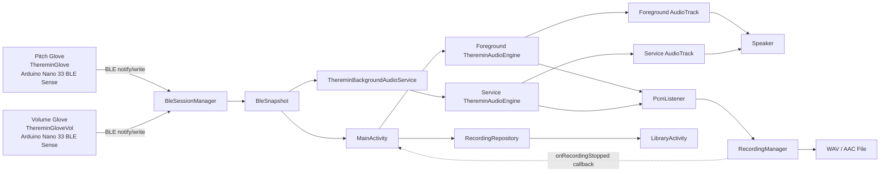
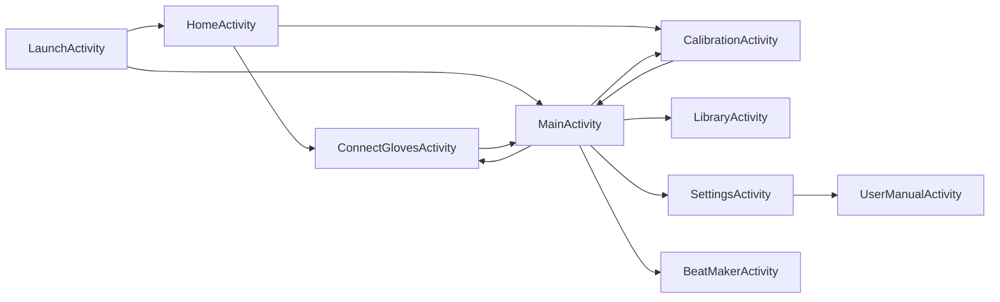
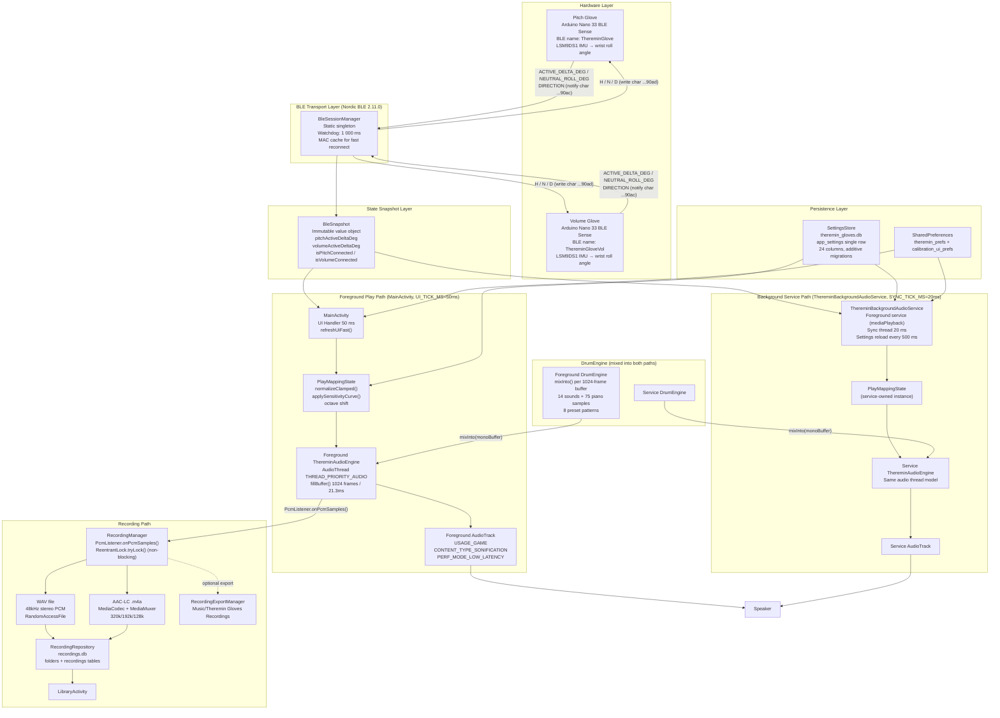
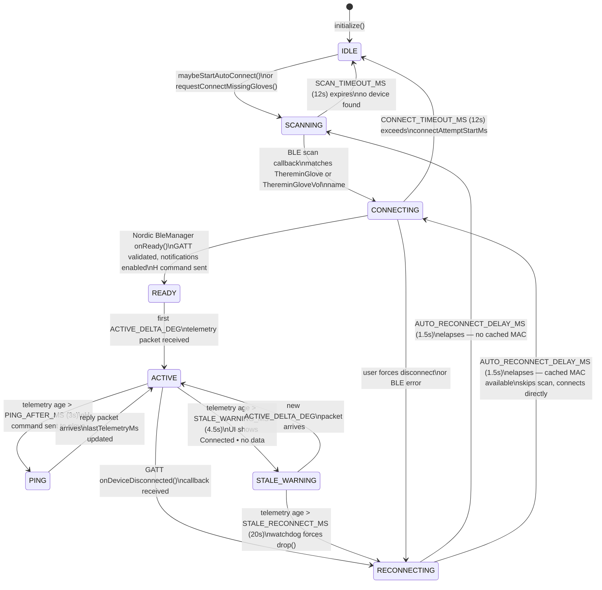
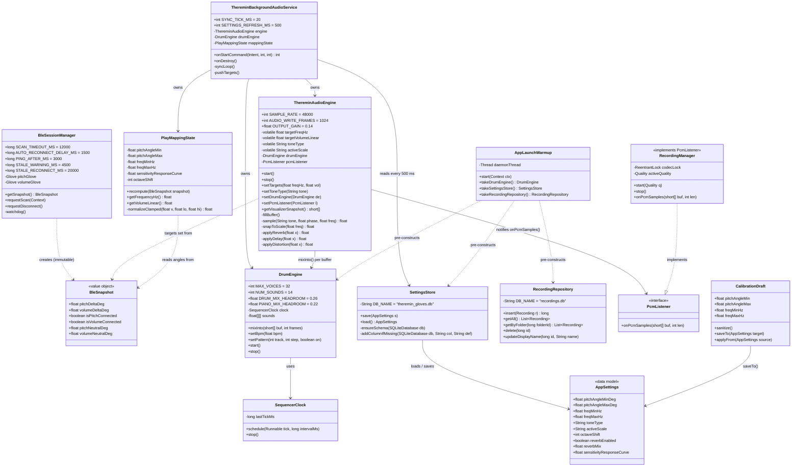
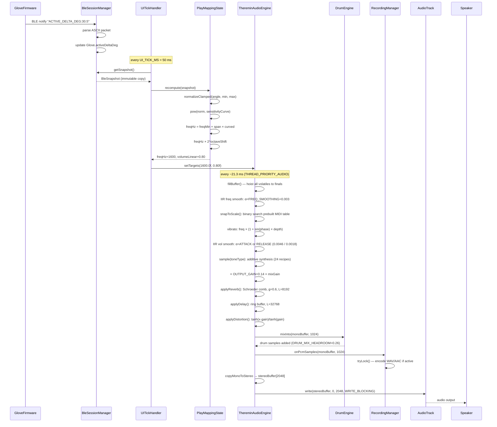
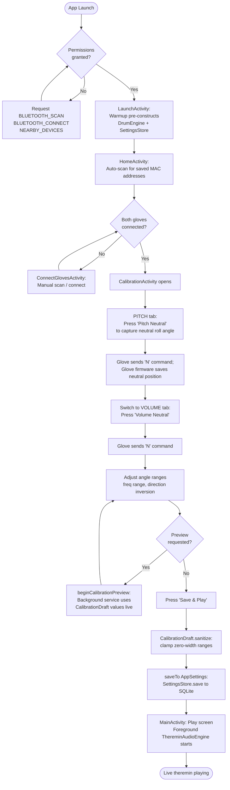
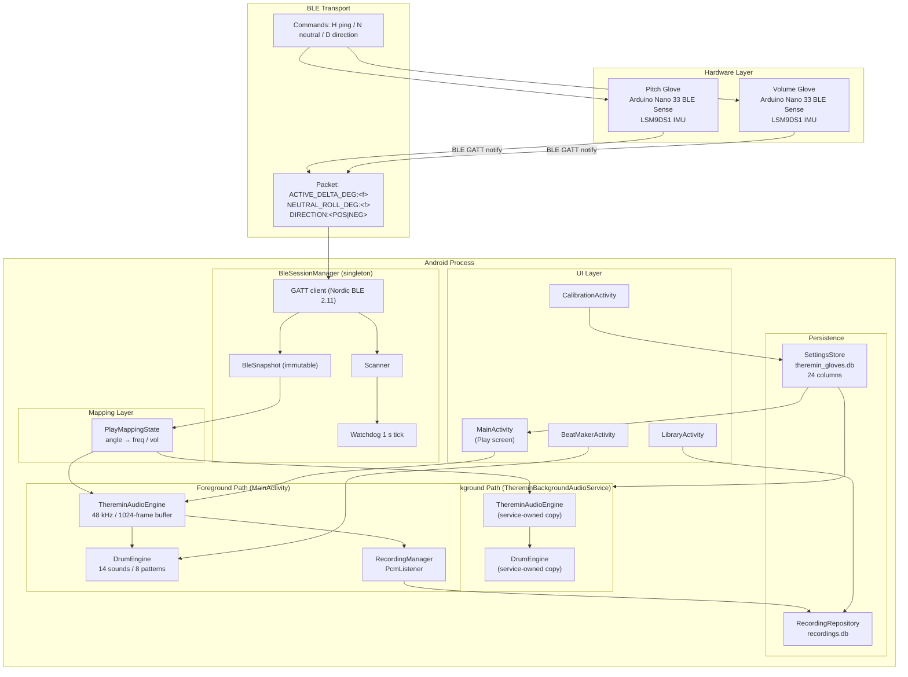

# Theremin Gloves — Design Document (Revised)

**Course:** COEN 390 / ELEC 390, Concordia University, Winter 2026  
**Team 5:** Niraj Patel, Matei Moldovan, Nirthika Ilaiyarajah, Ayan Pirani, Marie Ella Cambay

## At A Glance

| Item | Value |
|---|---|
| Hardware | Two Arduino Nano 33 BLE Sense gloves + Android phone |
| BLE library | Nordic `no.nordicsemi.android:ble:2.11.0` |
| BLE host | `BleSessionManager` static singleton |
| Foreground audio | `ThereminAudioEngine` → `AudioTrack` (MainActivity) |
| Background audio | `ThereminBackgroundAudioService` (20 ms sync loop) |
| Recording tap | `PcmListener` → `RecordingManager` → WAV / AAC file |
| Public Play tones | 11 (THEREMIN through HELICOPTER) |
| Audio buffer | `AUDIO_WRITE_FRAMES = 1024` frames @ 48 kHz ≈ 21.3 ms |
| Sample rate | `SAMPLE_RATE = 48000 Hz` |
| Orientation | Portrait-locked (all activities) |
| Java source files | 34 |
| SQLite databases | 2 (`theremin_gloves.db`, `recordings.db`) |

This document is intentionally current-build specific. If an older Sprint note conflicts with this file, the current code and this audited draft take precedence.

## Architecture Diagram



## Activity Flow Diagram



## 1. System Overview
Theremin Gloves is an Android application that turns two BLE-connected Arduino Nano 33 BLE Sense gloves into a wireless gesture instrument. The pitch glove (`ThereminGlove`) streams wrist-angle telemetry that becomes frequency, the volume glove (`ThereminGloveVol`) streams wrist-angle telemetry that becomes amplitude, and the phone synthesizes audio locally in real time through `AudioTrack`. The product targets music students, hobbyist musicians, creators, and demo-oriented performers who want an expressive electronic instrument without physical contact, external synth hardware, or cloud services.

## 2. System Architecture

This section moves from screens to shared classes to the live data path so a reviewer can understand the system top-down.

### Activity classes and their roles
- `LaunchActivity`: launcher/loader screen. It warms heavy dependencies with `AppLaunchWarmup.begin(...)`, initializes BLE, resolves Bluetooth permissions and Bluetooth-off state, then routes first-time users to `HomeActivity` and returning users to `MainActivity`.
- `HomeActivity`: setup/onboarding screen. It prompts for BLE prerequisites, triggers `BleSessionManager.maybeStartAutoConnect()`, shows pair status, and auto-opens Play when both gloves are connected.
- `MainActivity`: the Play screen. It owns the foreground `ThereminAudioEngine`, foreground `DrumEngine`, recording UI, tone/effects/scale/octave controls, Beat Maker preview overlay, and the handoff logic between foreground playback and `ThereminBackgroundAudioService`.
- `ConnectGlovesActivity`: manual BLE control screen. It exposes connect/disconnect/reconnect actions for each glove and shows per-glove connection detail from `BleSnapshot`.
- `CalibrationActivity`: calibration screen. It edits a mutable `CalibrationDraft`, captures neutral positions, previews live audio through `ThereminBackgroundAudioService.beginCalibrationPreview(...)`, copies finalized values back into an `AppSettings` object, and then persists them through `SettingsStore`.
- `LibraryActivity`: recording browser/player. It loads metadata from `RecordingRepository`, supports search, folder organization, playback through `MediaPlayer`, rename/delete/move flows, playback modes, and custom date/duration filtering.
- `SettingsActivity`: settings screen. It toggles background audio, extended frequency range, pitch/volume direction, rename-dialog behavior, recording quality, calibration-guide visibility, and sensitivity response curve.
- `BeatMakerActivity`: dedicated 16-step sequencer editor. It uses `StepGridView`, `PianoKeyboardView`, and a local preview `AudioTrack` to edit drum/bass/piano patterns without going through the theremin audio engine.
- `UserManualActivity`: in-app user manual. Opened from Settings, it displays all 11 manual sections as scrollable cards with hardcoded content — no external file reads or network requests. The content mirrors `docs/03_User_Manual.md`.

### Non-Activity classes and their roles
- `BleSessionManager`: process-wide BLE host. It scans, connects, reconnects, runs the watchdog, stores cached glove MAC addresses, parses telemetry packets, exposes immutable `BleSnapshot` state, and handles Bluetooth permission/prompt flows.
- `BleSnapshot`: immutable read model describing Bluetooth state, per-glove connection state, latest telemetry, stale-data warnings, and recent event text for the UI.
- `ThereminGloveBleManager`: Nordic `BleManager` wrapper for one glove connection. It validates the custom service/characteristics, enables notifications, writes commands, and forwards callbacks to `BleSessionManager`.
- `PlayMappingState`: pure mapping state for Play. It converts live glove angles into mapped frequency/volume targets, clamps ranges, applies the sensitivity curve, and zeroes output when the instrument is not ready.
- `ThereminAudioEngine`: real-time synthesis engine. It owns the `AudioTrack`, synthesizes the theremin tone, applies vibrato/effects/scale snap, mixes optional `DrumEngine` PCM into the same mono buffer, exposes a visualizer snapshot, and provides the `PcmListener` tap used for recording.
- `ThereminBackgroundAudioService`: foreground audio service used when playback must survive outside the Play screen and during calibration preview. It owns its own `ThereminAudioEngine`, its own `DrumEngine`, and a 20 ms sync loop that mirrors `BleSnapshot` and saved settings into the service-owned engine.
- `DrumEngine`: PCM drum/bass engine. It precomputes PCM assets, schedules step timing, mixes active voices into a caller-owned mono buffer, and supports preset slots, custom Beat Maker patterns, BPM, bass, and piano synth modes.
- `SequencerClock`: self-rescheduling 16th-note clock used by the beat system to advance steps without cumulative drift.
- `RecordingManager`: `ThereminAudioEngine.PcmListener` implementation. It captures the mixed mono render buffer before stereo duplication, writes WAV directly, or encodes AAC through `MediaCodec`/`MediaMuxer`.
- `RecordingRepository`: SQLite metadata store for recordings and folders. It persists file path, name, duration, creation time, folder membership, and quality.
- `RecordingExportManager`: creates a user-visible export copy in `Music/Theremin Gloves Recordings` while the app-private original remains under internal storage.
- `SettingsStore`: single-row SQLite persistence for theremin settings plus shared-preference helpers for small UI flags.
- `AppSettings`: value object for persisted theremin/calibration/effects/sensitivity settings and their defaults.
- `CalibrationDraft`: mutable staging object for unsaved calibration edits, with sanitization and summary formatting.
- `PlayUiText`: Play-screen text formatter for titles, live frequency/volume strings, and stage-mode pills.
- `AppLaunchWarmup`: process-wide warmup cache for `SettingsStore`, `AppSettings`, `RecordingRepository`, and a warmup `DrumEngine`.
- `RecordingListAdapter`: `RecyclerView.Adapter` for library folders and recordings, including drag-into-folder and multi-select support.
- `TopNavBarView`: reusable top bar with back button, left action, glove status icons, optional overflow, and helper navigation utilities.
- `BottomNavBarView`: reusable five-tab bottom navigation bar for Play, Connect, Cal, Library, and Settings.
- `NavigationUtils`: screen navigation helpers and the reusable `Poller` class used by multiple Activities for periodic UI refresh.
- `ThereminVisualizerView`: custom waveform renderer for live Play audio.
- `ToneKnobView`: custom rotary selector for the public tone cycle.
- `KnobControlView`: custom dial control reused for calibration-style numeric adjustment.
- `StepGridView`: custom 13×16 drum/bass step-grid renderer and editor.
- `PianoKeyboardView`: on-screen piano keyboard used in Beat Maker and Play melody input.
- `PianoStepStripView`: piano-step strip helper used by the sequencer UI.
- `InsetAwareScrollView`: inset-aware scroll container that adds system-bar padding automatically.
- `Instrument` and `SynthInstrument`: lightweight PCM instrument abstractions retained for synth/sample wrappers inside the beat system.

### Data flow: Arduino glove to audio output
1. Each glove’s Arduino Nano 33 BLE Sense computes orientation from its IMU and advertises a custom BLE service.
2. The glove firmware sends ASCII packets such as `ACTIVE_DELTA_DEG:<float>`, `NEUTRAL_ROLL_DEG:<float>`, and `DIRECTION:<text>` over the TX notify characteristic.
3. `BleSessionManager` scans for devices named `ThereminGlove` and `ThereminGloveVol`, connects through `ThereminGloveBleManager`, enables notifications, and parses each packet in `handleNotification(...)`.
4. Parsed glove state is copied into a fresh immutable `BleSnapshot` returned by `BleSessionManager.getSnapshot()`.
5. In foreground Play, `MainActivity.refreshUiFast()` calls `play.syncLive(snapshot)` and `play.recompute(snapshot)`, then pushes the latest targets into `ThereminAudioEngine` with `audioEngine.setTargets(...)`.
6. In background/calibration preview, `ThereminBackgroundAudioService.pushTargets(...)` performs the same mapping every `SYNC_TICK_MS = 20` ms and pushes targets into the service-owned engine.
7. `ThereminAudioEngine` smooths target frequency/volume, synthesizes the current tone, optionally mixes `DrumEngine`, duplicates the mono buffer to stereo, and writes it to `AudioTrack`.
8. In parallel, the same mono render buffer is forwarded through the `PcmListener` tap to `RecordingManager`, which writes WAV or AAC output.
9. When recording stops, `MainActivity` receives the callback, optionally exports a user-visible copy, and saves recording metadata through `RecordingRepository`.

The practical separation is clean: BLE owns live telemetry, mapping owns control conversion, the audio engine owns synthesis, and the repository owns persisted metadata.

### Static singleton pattern in `BleSessionManager`
`BleSessionManager` is implemented as a process-wide static singleton: all mutable BLE state lives in static fields, all public entry points are static, and a static main-thread `Handler MAIN` serializes BLE operations. This design is used because BLE connectivity must survive screen changes cleanly. `HomeActivity`, `ConnectGlovesActivity`, `CalibrationActivity`, `MainActivity`, and `LaunchActivity` all need the same live connection state, recent telemetry, cached device addresses, and watchdog behavior. A process-wide singleton avoids duplicate scanners, duplicate GATT sessions, conflicting reconnect timers, and the need to rehydrate BLE state every time the user changes screens.

### How `MainActivity` and `ThereminBackgroundAudioService` handle audio ownership
The app does not currently share one literal `ThereminAudioEngine` instance between `MainActivity` and `ThereminBackgroundAudioService`. Instead:
- `MainActivity` owns a foreground `ThereminAudioEngine` while the Play screen is visible.
- `ThereminBackgroundAudioService` owns a separate service-side `ThereminAudioEngine` while background audio or calibration preview is active.
- `MainActivity` mirrors scale/effects/drum/bass/tone state into the service through static service setters such as `setActiveScale(...)`, `setReverbEnabled(...)`, `setToneTypeNow(...)`, `setRecordingManager(...)`, `startIfNeeded(...)`, and `stopIfRunning(...)`.
- This means the user experiences a playback handoff, but the implementation is a foreground-engine/service-engine ownership swap rather than two screens sharing one common object reference.

## 3. Hardware

### Arduino platform and sensors
- Each glove uses an Arduino Nano 33 BLE Sense.
- The relevant sensor path is the on-board IMU. The Android code assumes the glove firmware converts IMU data into a roll-derived control signal before transmission.
- The app does not recompute roll from raw accelerometer/gyroscope samples. It consumes the preprocessed telemetry emitted by the glove firmware.

### Two-glove setup
- Pitch glove BLE name: `ThereminGlove`
- Volume glove BLE name: `ThereminGloveVol`
- The pitch glove controls frequency.
- The volume glove controls amplitude.

### BLE service and characteristics
- Custom service UUID: `12345678-1234-1234-1234-1234567890ab`
- TX notify characteristic UUID: `12345678-1234-1234-1234-1234567890ac`
- RX write characteristic UUID: `12345678-1234-1234-1234-1234567890ad`

### Glove-to-phone packet formats parsed by Android
- `ACTIVE_DELTA_DEG:<float>`: current roll delta used for live pitch/volume mapping.
- `NEUTRAL_ROLL_DEG:<float>`: current neutral baseline captured by the glove.
- `DIRECTION:<text>`: current direction mode reported by the glove after a direction sync/toggle.

### Phone-to-glove commands sent by Android
- `H`: handshake / refresh request.
- `N`: capture the current wrist orientation as the new neutral position.
- `D`: toggle the glove’s direction mode.

## 4. BLE Communication Layer

### How `BleSessionManager` works
- Initialization: `BleSessionManager.initialize(context)` stores the application context, restores cached device addresses, registers the Bluetooth-state receiver once, and starts the watchdog loop.
- Scanning: `maybeStartAutoConnect()` and `requestConnectMissingGloves()` eventually call an internal scan path that looks for the two expected BLE names. A scan timeout stops discovery after `SCAN_TIMEOUT_MS`.
- Connecting: once a target device is found, `ThereminGloveBleManager.connectTo(...)` starts a Nordic BLE connection with `retry(3, 250)` and a configurable timeout. `onReady()` sends the handshake and enables notifications.
- Reconnecting: if a glove drops unexpectedly, `drop(...)` clears live connection state and schedules `AUTO_RECONNECT_DELAY_MS` reconnect logic. Cached MAC addresses let reconnect attempts skip a full name-based scan when possible.
- Watchdog: the main-thread watchdog runs every `WATCHDOG_PERIOD_MS`. It refreshes truth, checks connect timeouts, checks telemetry age, pings silent gloves, and forces reconnects when the connection looks alive but no telemetry is arriving.

### Exact BLE timing constants from code
- `SCAN_TIMEOUT_MS = 12_000L`
- `CONNECT_TIMEOUT_MS = 12_000L`
- `AUTO_RECONNECT_DELAY_MS = 1_500L`
- `PING_AFTER_MS = 3_000L`
- `STALE_WARNING_MS = 4_500L`
- `STALE_RECONNECT_MS = 20_000L`
- `WATCHDOG_PERIOD_MS = 1_000L`

### Silent disconnect detection
The app distinguishes a true Android GATT disconnect from a silent telemetry stall:
- Every received telemetry packet updates `glove.lastTelemetryMs`.
- If telemetry age exceeds `STALE_WARNING_MS = 4500 ms`, the glove is marked stale and the UI shows `Connected • no data`.
- If telemetry age exceeds `PING_AFTER_MS = 3000 ms` and at least 2 seconds have elapsed since the last ping, `BleSessionManager` sends another `H` handshake to prompt a reply.
- If telemetry age exceeds `STALE_RECONNECT_MS = 20_000 ms`, the app treats the session as dead, drops the glove, and schedules reconnect.
- Separate logic also aborts a connect attempt if `connectAttemptStartMs` exceeds `CONNECT_TIMEOUT_MS = 12_000 ms`.

### Android 12+ permission handling
- Android 12 and higher: `BLUETOOTH_SCAN` and `BLUETOOTH_CONNECT`
- Android 11 and lower: `ACCESS_FINE_LOCATION`
- The permission helpers are centralized in `BleSessionManager.hasRequiredPermissions(...)`, `requestRequiredPermissions(...)`, and `wereAllPermissionsGranted(...)`.
- `LaunchActivity`, `HomeActivity`, `ConnectGlovesActivity`, and `MainActivity` all call these helpers instead of duplicating version-specific permission logic.

### Nordic BLE library version and rationale
- Dependency: `no.nordicsemi.android:ble:2.11.0`
- The code uses Nordic’s `BleManager` abstraction instead of raw Android `BluetoothGatt` directly.
- Why this is beneficial here: it provides queued connection/notification/write operations, cleaner state callbacks, built-in retry/timeout helpers, and a smaller surface area for Android GATT race conditions than hand-written raw `BluetoothGatt` code.
- The project uses Nordic features: `retry(3, 250)`, structured notification enabling via `enableNotifications(txCharacteristic).enqueue()`, and centralized failure callbacks via `BleManagerCallbacks`.

### Why `useAutoConnect(false)` — custom reconnect instead of Android’s built-in
The connection builder in `ThereminGloveBleManager.connectTo(...)` explicitly sets `.useAutoConnect(false)`. Android’s built-in auto-connect (`BluetoothDevice.connectGatt(context, true, callback)`) caches device addresses in the OS and attempts reconnection indefinitely, but it is well-documented to get stuck: cached entries go stale, GATT state machines enter unrecoverable states, and callbacks are sometimes never delivered. The result can be a phantom "Connecting…" state that only a Bluetooth power-cycle can escape.

Using `useAutoConnect(false)` keeps every GATT session explicit. When a glove drops, `BleSessionManager.drop(...)` calls `close()` on the old manager, allocates a fresh `ThereminGloveBleManager`, and starts a new explicit connection — either directly to the cached MAC address (skipping a full scan) or by re-scanning for the device name. This produces reliable, diagnosable reconnect behavior and is why the watchdog exists: it drives all reconnect decisions rather than delegating them to the OS.

### No BLE bonding — unauthenticated connections only
The `Callbacks` class inside `ThereminGloveBleManager` leaves `onBondingRequired`, `onBonded`, and `onBondingFailed` as empty no-ops. Glove connections are unauthenticated: no PIN, no passkey, no bond database entry. The custom UUIDs and BLE device names serve as implicit gates without adding pairing complexity. Users never see a system pairing dialog.

### Firmware-side BLE: `ArduinoBLE` library and 32-byte characteristic limit
The glove firmware (`arduino/ble.cpp`) uses the Arduino `ArduinoBLE` library (`#include <ArduinoBLE.h>`), which is unrelated to the Nordic Android library. The two libraries interoperate via the standard GATT protocol — Nordic on the phone side, ArduinoBLE on the Arduino side.

Each characteristic is declared as a `BLEStringCharacteristic` with a maximum of 32 bytes:

```cpp
static BLEStringCharacteristic gTxChar(kTxUuid, BLERead | BLENotify, 32);
static BLEStringCharacteristic gRxChar(kRxUuid, BLERead | BLEWrite,  32);
```

`bleSendLine()` truncates any outgoing string to 31 characters before writing, reserving one byte for the null terminator within the BLE string type. This is a hard protocol constraint: any packet whose ASCII representation exceeds 31 characters is silently truncated. Current packet types stay well within the limit:

| Packet | Max example | Length |
|---|---|---|
| `ACTIVE_DELTA_DEG:<float>` | `ACTIVE_DELTA_DEG:-123.45` | 25 chars |
| `NEUTRAL_ROLL_DEG:<float>` | `NEUTRAL_ROLL_DEG:-123.45` | 25 chars |
| `DIRECTION:POSITIVE` | `DIRECTION:POSITIVE` | 19 chars |

Initial values written at firmware boot: TX characteristic gets `"BOOT"`, RX characteristic gets `"ready"`.

### Same UUIDs for both gloves — differentiated by name only
Both `ThereminGlove` and `ThereminGloveVol` advertise the identical service UUID and TX/RX characteristic UUIDs. They are distinguished solely by their BLE advertised local name. `BleSessionManager` opens two independent GATT sessions keyed by MAC address, so UUID collisions between the two sessions are not an issue — the Android GATT stack routes callbacks by device address, not by UUID.

## 5. IMU Processing and Gesture Mapping

### How `ACTIVE_DELTA_DEG` relates to `NEUTRAL_ROLL_DEG`
The Android app treats `ACTIVE_DELTA_DEG` as already relative to the glove’s neutral position. In other words, the glove firmware captures a neutral roll angle as `NEUTRAL_ROLL_DEG`, then sends a live delta that is measured relative to that neutral reference. The Android side does not recompute that subtraction from raw IMU values; it simply parses the already-relative delta and maps it to sound.

### Frequency mapping in `PlayMappingState`
`PlayMappingState.recompute(...)` uses:

```text
pitchNorm = applySensitivityCurve(
    clamp((pitchActiveDeltaDeg - pitchAngleMinDeg) /
          (pitchAngleMaxDeg - pitchAngleMinDeg), 0, 1))

freq = freqMinHz + (freqMaxHz - freqMinHz) * pitchNorm
```

Then, if octave shift is enabled:

```text
freq = clamp(freq * 2^octaveShift, 20, 20000)
```

Additional guards:
- if the pitch glove has no angle, frequency falls back to `freqMinHz`
- if the instrument is not ready, volume is forced to zero

### Volume mapping in `PlayMappingState`
`PlayMappingState.recompute(...)` uses:

```text
volNorm = applySensitivityCurve(
    clamp((volActiveDeltaDeg - volumeAngleMinDeg) /
          (volumeAngleMaxDeg - volumeAngleMinDeg), 0, 1))

volume = 0 + (1 - 0) * volNorm
```

Then:
- if the volume glove has no angle, volume becomes `0`
- if Bluetooth is off or one glove is missing, `audioTargetVolumeLinear = 0`

### Smoothing in `ThereminAudioEngine`
- `FREQ_SMOOTHING = 0.0030f`
- `ATTACK_SMOOTHING = 0.0046f`
- `RELEASE_SMOOTHING = 0.0018f`

Implementation details:
- `smoothFreqHz += (targetFreqHz - smoothFreqHz) * FREQ_SMOOTHING`
- `smoothVolumeLinear += (target - smoothVolumeLinear) * attackOrReleaseFactor`
- Attack and release use different constants so notes fade in faster than they fade out.

### Why there is no explicit dead zone
There is no dedicated Java-side dead-zone constant in the current Play mapping path. Instead, three existing mechanisms already suppress micro-jitter:
- calibration lets the user choose a meaningful angle span
- the sensitivity response curve reshapes normalized motion
- `ThereminAudioEngine` smooths both pitch and volume continuously

That means the app currently solves the “tiny hand tremor” problem with calibration plus smoothing rather than a hard dead-band clamp.

## 6. Audio Engine

### `AudioTrack` configuration
- `SAMPLE_RATE = 48000`
- `CHANNEL_MASK = AudioFormat.CHANNEL_OUT_STEREO`
- `ENCODING = AudioFormat.ENCODING_PCM_16BIT`
- `AUDIO_WRITE_FRAMES = 1024`
- Effective stereo write size per buffer: `1024 frames × 2 channels × 2 bytes = 4096 bytes`
- `MIN_STREAM_BUFFER_BYTES = 4096`

The engine builds a low-latency `AudioTrack` with:
- usage: `USAGE_GAME`
- content type: `CONTENT_TYPE_SONIFICATION`
- low-latency performance mode on Android O+

### Current public tone set
The current Play build exposes **11 user-selectable tones**, not the older 9-waveform list that earlier documents referenced:
- `THEREMIN`: heterodyne-inspired harmonic stack with a strong second partial for the classic vocal/cello theremin color.
- `AIR_PAD`: soft detuned sine pad with slow beating and low spectral centroid.
- `CELLO`: bowed-string style preset with emphasized first partials and gentle FM motion.
- `PAD`: warm harmonic pad built from a detuned sine stack.
- `CHOIR`: soft vocal pad with shallow phase modulation and low-order harmonics.
- `FLUTE`: near-pure flute tone with only a tiny upper-harmonic shimmer.
- `CLARINET`: odd-harmonic closed-pipe spectrum that stays warm and woody.
- `TRIANGLE`: triangle-derived tone with boosted odd upper partials for extra brightness.
- `SAW`: additive saw-style spectrum using the first six harmonics.
- `SQUARE`: odd-harmonic square wave; hollow, reedy quality.
- `HELICOPTER`: rotor-like pulse tone whose theremin pitch controls chop rate (0.75–12 Hz).

Hidden legacy tone strings such as `PULSE`, `ORGAN`, `STRING`, `BELL`, `DRUM_KIT`, `TRUMPET`, and others are still supported internally for backward compatibility, but they are not in the public tone picker.

### Vibrato
- Rate: `VIBRATO_RATE_HZ = 4.2f`
- Minimum depth: `MIN_VIBRATO_DEPTH = 0.0003f`
- Maximum depth: `MAX_VIBRATO_DEPTH = 0.0014f`
- Depth scaling: vibrato depth grows with current smoothed volume:

```text
mix = clamp((smoothVolumeLinear - 0.03) / 0.35, 0, 1)
depth = MIN_VIBRATO_DEPTH + (MAX_VIBRATO_DEPTH - MIN_VIBRATO_DEPTH) * mix
```

So louder playing introduces slightly deeper vibrato than very quiet playing.

### PCM tap and `RecordingManager`
- `ThereminAudioEngine` defines the `PcmListener` interface.
- `RecordingManager` implements `ThereminAudioEngine.PcmListener`.
- The engine calls `listener.onPcmSamples(monoBuffer, monoBuffer.length)` before the mono buffer is duplicated into stereo for `AudioTrack`.
- Because the tap is pre-stereo and post-drum-mix, recordings capture the exact synthesized output rather than microphone audio.

### Background service and 20 ms sync loop
- `ThereminBackgroundAudioService` owns a service-side `ThereminAudioEngine` and `DrumEngine`.
- Its worker thread sleeps for `SYNC_TICK_MS = 20`.
- On each tick it reloads persisted settings as needed, reads `BleSnapshot`, applies scale/effects/drum/bass/tone/octave state, computes current frequency/volume targets, and pushes them to the service-owned audio engine.
- This same loop is also used for calibration preview.

### Tone synthesis recipes

All 11 public tones are computed in `ThereminAudioEngine.sample()` using three
building blocks:

- **Additive synthesis** — sum of sines at integer multiples of the running phase.
- **FM / PM synthesis** — carrier `sin(phase + I × sin(phase × R))` where `I` is the
  modulation index and `R` is the ratio. Depth is often scaled by `volume` or `motion`
  (a slow sub-LFO derived from `vibratoPhase × 0.60`).
- **`saturate(value, gain) = tanh(value × gain)`** — symmetric soft-clip used as the
  final stage on most tones. It tames peaks across summed harmonics and adds subtle
  warmth without the raspy edge of hard clipping.

| Tone | Technique | Key recipe details |
|---|---|---|
| THEREMIN | Additive | 5 harmonics: 1.0, 0.35, 0.18, 0.07, 0.03 — strong 2nd partial gives the classic cello/vocal warmth |
| AIR_PAD | Detuned additive | Three sines: ×1.000, ×1.002, ×0.998 — microscopic detuning produces slow beating that keeps sustained notes alive |
| CELLO | FM + additive | 1:1 FM carrier (index 0.10–0.16 modulated by `motion`) plus harmonics 2, 3, 4 — suggests bow pressure |
| PAD | Detuned additive | Like Air Pad with wider detuning (±0.003) and a 5th partial |
| CHOIR | PM + additive | Carrier PM'd at ×2 (index 0.10–0.16); low-order harmonics 2–4; no volume scaling |
| FLUTE | PM + additive | Very shallow PM at ×2 (index ≈ 0.10); tiny 2nd harmonic; near-pure sine character |
| CLARINET | Additive (odd only) | Harmonics 1, 3, 5, 7, 9 at 1.0, 0.36, 0.19, 0.10, 0.05 — closed-pipe odd-harmonic spectrum |
| TRIANGLE | Triangle + additive | `(2/π) arcsin(sin(phase))` as triangle core, then adds boosted 3rd, 5th, 7th partials |
| SAW | Additive | Harmonics 1–6 at 0.72, 0.36, 0.23, 0.16, 0.10, 0.06 — partial roll-off approximates a sawtooth |
| SQUARE | Additive (odd only) | Harmonics 1, 3, 5, 7, 9 at 0.86, 0.28, 0.15, 0.08, 0.04 — soft square with `saturate(v, 0.96)` |
| HELICOPTER | Pulse chop | Theremin pitch maps to pulse chop rate 0.75–12 Hz; each pulse is a brief sine burst |

### DrumEngine — sound synthesis

All 14 sounds are pre-rendered at construction into `float[]` PCM arrays at 48 kHz. No `.wav`
files, no `SoundPool`. Synthesis runs in parallel across up to 4 threads during construction.

| Sound | Duration | Technique |
|---|---|---|
| Kick | 400 ms | Pitch-swept harmonic sine. Frequency starts at 255 Hz, decays to ~66 Hz via `exp(−30t)`. Three harmonics (0.70, 0.22, 0.08). Amplitude envelope `exp(−6t)` |
| Snare | 200 ms | 220 Hz sine body `exp(−18t)` mixed with HPF white noise (1-pole coeff 0.93) at `exp(−14t)`. Body : noise ratio ≈ 0.50 : 0.52 |
| Closed hi-hat | 70 ms | HPF white noise (coeff 0.97), fast decay `exp(−40t)` — tight metallic click |
| Open hi-hat | 250 ms | HPF white noise (coeff 0.95), slower decay `exp(−8t)` — washy sustain |
| Crash cymbal | 650 ms | HPF noise (coeff 0.84) plus weak 210 Hz body sine, long decay `exp(−4.5t)` |
| Clap | 140 ms | Three staggered noise bursts at t = 0, 5 ms, 10 ms, each at `exp(−38t)`. Peak-normalized to 0.88 |
| Bass E2 / A2 / D3 / G2 | 550 ms | 4 harmonics (0.55, 0.35, 0.14, 0.05). Natural pitch sag: starts 1.5% flat, rises to nominal via `exp(−15t)`. Sustained decay `exp(−3t)`. 2nd/3rd harmonics boosted for audibility on phone speakers |
| Hi tom | 420 ms | Pitch-swept sine from 300 Hz, `exp(−t/0.14)` amplitude, pitch decays via `exp(−8t)` |
| Low tom | 540 ms | Same as hi tom but from 180 Hz with longer 0.18 s decay constant |
| Rimshot | 50 ms | Simple 1-pole HPF Gaussian noise (coeff 1.0), very fast decay `exp(−60t)` |
| Shaker | 80 ms | HPF Gaussian noise (coeff 0.85), decay `exp(−30t)` |

The voice pool is lock-free: `voiceSound` and `voicePos` are `AtomicIntegerArray` with 32
slots. `triggerVoice()` finds the first free slot (pos < 0). `mixInto()` advances each active
voice sample-by-sample and marks it free when it reaches the end.

### DrumEngine — 8 preset beat patterns

Each pattern is a 6-row × 16-column boolean grid at 16th-note resolution (rows: kick, snare,
closed hi-hat, open hi-hat, crash, clap). Each pattern has a paired bass pattern selecting among
E2, A2, D3, and G2.

| # | Name | Character |
|---|---|---|
| 0 | Rock | Kick on beats 1 & 3 with pickup; 8th-note closed hat; open hat on &-of-2, &-of-4 |
| 1 | Funk | Syncopated kick; 16th-note hat throughout; ghost + main snare on 4 |
| 2 | EDM | Four-on-floor kick; open hat on all upbeats; clap on 2 & 4; crash on beat 1 |
| 3 | Hip-Hop | Heavy syncopated kick; sparse snare on 2 & 4; 8th-note hat |
| 4 | Reggae (One-Drop) | Kick on beat 3 only; open hat on & of every beat |
| 5 | Jazz | Sparse kick comp; snare on &-of-2 and &-of-4; open hat swings on &-of-every-beat |
| 6 | Trap | Four-on-floor kick; dense 16th-note hat; clap on 2 & 4 (no snare row) |
| 7 | Latin/Samba | Clave-inspired kick; 16th-note hat; crash on beat 1; open hat on &-of-2, &-of-4 |

`SequencerClock` uses a self-rescheduling single-shot approach: each tick schedules the next
tick based on `System.currentTimeMillis()` delta, so BPM changes take effect on the next step
with no restart and no audible glitch.

### DrumEngine — piano synthesis modes

The piano covers 25 chromatic notes, C3 (MIDI 48) through C5 (MIDI 72), pre-rendered at all
three modes at construction. Maximum 8 simultaneous piano voices; if all busy, the
furthest-advanced voice is stolen.

| Mode | Attack | Decay shape | Technique | Character |
|---|---|---|---|---|
| KEYS | 3 ms linear | `exp(−4.5t)`, 800 ms total | 4 harmonics (0.70, 0.20, 0.07, 0.03) | Warm mallet/marimba |
| BELLS | 2.5 ms linear | Dual-exp: `0.72×exp(−3.8t) + 0.28×exp(−8t)`, 1250 ms | 4 **inharmonic** partials at ×1, ×2.76, ×5.43, ×8.21 | Bell/metallophone shimmer |
| ORGAN | 10 ms linear | Near-sustained: `0.82 + 0.18×exp(−2.2t)`, 950 ms | 4 harmonics (0.58, 0.26, 0.11, 0.05) + 5.2 Hz vibrato | Hammond drawbar character |

### DrumEngine — arpeggio patterns

When melody mode is active, the sequencer fires arpeggiated piano chords on scheduled steps.
Up to 4 simultaneous root MIDI notes can be armed; each root fires the same arpeggio pattern
independently, producing harmonic chords.

| Index | Name | Semitone intervals from root |
|---|---|---|
| 1 | Major up | 0, 4, 7, 12 |
| 2 | Minor up | 0, 3, 7, 12 |
| 3 | Pentatonic run | 0, 2, 4, 7, 9, 12 |
| 4 | Major up & back | 0, 4, 7, 12, 7, 4 |

The arpeggio clock is sample-accurate: `arpNextFireSample` advances against `arpSampleClock`
(incremented per PCM sample in `mixInto()`) rather than a wall-clock timer, so arpeggio timing
stays locked to the audio buffer regardless of scheduling jitter.

## 7. Recording System

### `RecordingManager`
- Capture source: `ThereminAudioEngine.PcmListener`
- Input data: mixed mono PCM from the live synth path
- File output: mono input is duplicated into stereo for saved files
- Storage guard: `MIN_FREE_BYTES = 10 * 1024 * 1024`

### Quality modes
- `LOSSLESS`: WAV, PCM 16-bit, 48 kHz, stereo, no codec
- `HIGH`: AAC-LC, 320 kbps, 48 kHz, stereo (`.m4a`)
- `MEDIUM`: AAC-LC, 192 kbps, 48 kHz, stereo (`.m4a`)
- `LOW`: AAC-LC, 128 kbps, 48 kHz, stereo (`.m4a`)

### `RecordingRepository` schema and file location
- Database file: `recordings.db`
- Tables:
  - `folders(id, name, created_at_ms)`
  - `recordings(id, file_path, display_name, duration_ms, created_at_ms, folder_id, quality)`
- App-private primary recording files: `getFilesDir()/recordings/`
- Optional exported user-visible copies: `Music/Theremin Gloves Recordings` via `RecordingExportManager`
- Important nuance: `recordings.db` stores the app-private original file path. The optional exported copy is a convenience duplicate, not a separately persisted repository record.

### `LibraryActivity` features
- load all saved recordings from `RecordingRepository`
- search by display name in real time
- rename recordings
- delete recordings
- create, rename, delete, and enter folders
- drag a recording onto a folder card to move it
- multi-select move/delete
- `MediaPlayer` playback
- mini-player with progress bar
- playback modes: sequential, single, loop one, loop all
- quality badge display
- custom duration filter
- custom date-range filter

## 8. Settings and Persistence

### `SettingsStore`
- Database name: `theremin_gloves.db`
- Table name: `app_settings`
- Storage model: one row with `id = 1`

### `app_settings` columns
- `id`
- `pitch_angle_min_deg`
- `pitch_angle_max_deg`
- `freq_min_hz`
- `freq_max_hz`
- `volume_angle_min_deg`
- `volume_angle_max_deg`
- `pitch_direction_inverted`
- `volume_direction_inverted`
- `tone_type`
- `pitch_enabled`
- `volume_enabled`
- `updated_at_ms`
- `active_scale`
- `octave_shift`
- `reverb_enabled`
- `reverb_mix`
- `delay_enabled`
- `delay_feedback`
- `delay_mix`
- `distortion_enabled`
- `distortion_gain`
- `sensitivity_level`
- `sensitivity_curve`

### Migration strategy
- `SettingsStore` uses `ensureSchema(db)` plus `addColumnIfMissing(...)`
- It does not rely on destructive migrations
- A process-wide `schemaVerifiedForProcess` flag avoids repeating `PRAGMA table_info(...)` and `ALTER TABLE` checks on every screen load

### SharedPreferences flags
- Preferences file `theremin_prefs`
  - `bg_audio_enabled`
  - `extended_frequency_range_enabled`
  - `audio_compression`
  - `show_rename_dialog_on_stop`
- Preferences file `calibration_ui_prefs`
  - `calibration_guide_learned`

### `AppSettings` fields and default values
These are the persisted theremin/calibration defaults loaded into a fresh `AppSettings` object and used by `SettingsStore` plus `CalibrationDraft`. They are not the narrower Play-screen reset defaults used by `PlayMappingState.restoreDefaults()`.

| Field | Default |
|---|---|
| `pitchAngleMinDeg` | `0f` |
| `pitchAngleMaxDeg` | `90f` |
| `freqMinHz` | `20f` |
| `freqMaxHz` | `2000f` |
| `volumeAngleMinDeg` | `0f` |
| `volumeAngleMaxDeg` | `90f` |
| `pitchDirectionInverted` | `false` |
| `volumeDirectionInverted` | `true` |
| `toneType` | `THEREMIN` |
| `pitchEnabled` | `true` |
| `volumeEnabled` | `true` |
| `activeScale` | `CHROMATIC` |
| `octaveShift` | `0` |
| `reverbEnabled` | `false` |
| `reverbMix` | `0.3f` |
| `delayEnabled` | `false` |
| `delayFeedback` | `0.35f` |
| `delayMix` | `0.4f` |
| `distortionEnabled` | `false` |
| `distortionGain` | `3.0f` |
| `sensitivityLevel` | `MEDIUM` |
| `sensitivityResponseCurve` | `1.0f` |

Important nuance:
- the SQLite schema default for `tone_type` is still `'SINE'` for backward compatibility, but `SettingsStore.load()` normalizes that legacy value to `THEREMIN`

Separate Play-only defaults used by `PlayMappingState.restoreDefaults()`:
- pitch angle range: `0f` to `90f`
- volume angle range: `0f` to `90f`
- frequency range: `20f` to `20 000f` (20 kHz; standard ceiling `2 000f` without extended-range setting)

## 9. Calibration System

### `CalibrationDraft` pattern
`CalibrationActivity` never writes directly into `AppSettings` while the user is still editing. Instead:
- persisted settings are loaded into a mutable `CalibrationDraft`
- the draft is edited through the calibration UI
- `CalibrationDraft.sanitize()` clamps angle/frequency bounds and enforces valid min/max relationships
- only when the user chooses Save does `draft.saveTo(settings)` copy the finalized values back into `AppSettings`

This avoids partial writes and makes Reload/Defaults behavior straightforward.

### `beginCalibrationPreview(...)` / `endCalibrationPreview()` flow
1. `CalibrationActivity.syncCalibrationPreview()` builds an `AppSettings` snapshot representing the current unsaved draft.
2. It calls `ThereminBackgroundAudioService.beginCalibrationPreview(context, previewSettings)`.
3. The service stores that preview object in `calibrationPreviewSettings`.
4. On each 20 ms service tick, `pushTargets(...)` uses `calibrationPreviewSettings` instead of the saved settings row.
5. When calibration is stopped, saved, or the screen leaves the foreground, `ThereminBackgroundAudioService.endCalibrationPreview()` clears the preview override.

### How neutral position is captured and stored
Neutral capture is a BLE/device-side operation:
1. The user presses `btnPitchNeutral` or `btnVolumeNeutral`.
2. `CalibrationActivity.handleNeutralCapture(...)` checks that the corresponding glove is connected.
3. `BleSessionManager.requestCaptureNeutral(isPitch)` sends the `N` command to the glove.
4. The glove replies with `NEUTRAL_ROLL_DEG:<float>`.
5. `BleSessionManager.handleNotification(...)` stores that value into the glove’s live state (`glove.neutralRollDeg`).
6. Future `ACTIVE_DELTA_DEG` packets are then interpreted relative to that neutral.

Important nuance: the neutral roll angle is not written into `SettingsStore`. The persisted calibration row stores pitch/volume/frequency ranges and tone settings; the live neutral reference itself lives in the glove/session state.

## 10. End-to-End Latency Analysis

### Fixed values from the current code
- BLE notification interval assumption: typically about `7.5–20 ms` on Android BLE links
- Background-service sync loop: `SYNC_TICK_MS = 20 ms`
- Foreground Play refresh loop: `UI_TICK_MS = 50 ms`
- Audio buffer: `AUDIO_WRITE_FRAMES / SAMPLE_RATE = 1024 / 48000 = 0.02133 s = 21.33 ms`

### Background/calibration path latency
This is the path used by `ThereminBackgroundAudioService` and calibration preview:

```text
Typical = BLE notify + average sync wait + audio buffer
        = 7.5–20 ms + ~10 ms + 21.33 ms
        = ~38.83–51.33 ms

Worst case = 20 ms + 20 ms + 21.33 ms
           = ~61.33 ms
```

### Foreground Play path latency
On the visible Play screen, `MainActivity.refreshUiFast()` runs every `UI_TICK_MS = 50 ms`, so the control-update cadence is currently looser than the service cadence:

```text
Typical = BLE notify + average UI wait + audio buffer
        = 7.5–20 ms + ~25 ms + 21.33 ms
        = ~53.83–66.33 ms

Worst case = 20 ms + 50 ms + 21.33 ms
           = ~91.33 ms
```

### Comparison against HD-11 (< 80 ms)
- Background/calibration path: comfortably under 80 ms even in the worst case.
- Foreground Play path: typical behavior is still under 80 ms, but a strict worst-case bound based on the current `UI_TICK_MS = 50 ms` exceeds 80 ms.
- This is why older documents that assumed `AUDIO_WRITE_SAMPLES = 2048` are now outdated: the current audio buffer is smaller (`1024` frames), but the real foreground limit is now the Play-screen refresh loop, not the service loop.

---

## 11. Expanded System Architecture Diagram

The diagram below augments Section 2 with explicit packet format labels, method names, and thread annotations.



---

## 12. BLE State Machine Diagram

Each glove instance in `BleSessionManager` follows this state machine. The watchdog (running every `WATCHDOG_PERIOD_MS = 1 000 ms`) drives all timed transitions.



**Notes:**
- Both the Pitch glove and Volume glove have independent state machine instances.
- `BleSnapshot.isPitchConnected()` returns true only in the `READY` or `ACTIVE` states.
- MAC addresses cached from the `READY` state enable the RECONNECTING→CONNECTING fast path (avoids full 12 s scan).

---

## 13. Thread Model

The app uses four distinct threads. Understanding their priorities and interactions is critical for understanding audio latency and thread safety.

| Thread | Android Priority | Typical Period | Responsibilities |
|---|---|---|---|
| **Main Thread** | Default (0) | Event-driven | Activity lifecycle callbacks, BleSessionManager watchdog (1 s), RecordingManager.start/stopRecording(), ThereminBackgroundAudioService static setters (setToneTypeNow, setReverbEnabled, etc.) |
| **UI Tick Handler** | Default (0) | 50 ms | MainActivity.refreshUiFast(), BleSnapshot.getSnapshot(), PlayMappingState.syncLive()+recompute(), ThereminAudioEngine.setTargets(), ThereminVisualizerView.invalidate() |
| **Service Sync Thread** | THREAD_PRIORITY_AUDIO (−16) | 20 ms | ThereminBackgroundAudioService sync loop: SettingsStore.load() every 500 ms, BleSnapshot.getSnapshot(), PlayMappingState.recompute(), ThereminAudioEngine.setTargets() (service engine) |
| **Audio Thread** | THREAD_PRIORITY_AUDIO (−16) | ~21.3 ms | ThereminAudioEngine.fillBuffer() (1024 samples), DrumEngine.mixInto(), PcmListener.onPcmSamples() (RecordingManager tap), copyMonoToStereo(), AudioTrack.write() |

**Thread safety summary:**

| Field / Class | Mechanism | Rationale |
|---|---|---|
| `ThereminAudioEngine.targetFreqHz` | `volatile` | Written from Main/Service thread; read in Audio thread. Single-word write is atomic on JVM. |
| `ThereminAudioEngine.toneType` | `volatile String` | Reference replacement is atomic on JVM. |
| All effect toggles in `ThereminAudioEngine` | `volatile boolean` | Single-word writes are atomic. |
| Inner loop constants in `fillBuffer()` | Hoisted to `final` locals | Prevents repeated volatile memory barriers inside 1024-sample loop. |
| `DrumEngine` voice pool | `AtomicIntegerArray` | Array element CAS operations are needed because multiple indices can be written simultaneously. A single volatile is not sufficient for array elements. |
| `RecordingManager` codec state | `ReentrantLock.tryLock()` | Non-blocking — audio thread drops buffer rather than stalling if finalization is in progress. |
| `BleSnapshot` | Immutable value object | Created atomically from static fields; no lock needed on the read side. |

---

## 14. Audio Signal Flow — Per-Buffer Pipeline

The following ASCII flow traces the exact execution sequence inside `ThereminAudioEngine.fillBuffer()` for one 1024-frame buffer.

```
┌─────────────────────────────────────────────────────────────────────┐
│  START OF fillBuffer(short[] monoBuffer)                            │
│                                                                     │
│  1. Hoist volatile reads to final locals:                           │
│     final float  tgtFreq   = targetFreqHz      (volatile)           │
│     final float  tgtVol    = targetVolumeLinear (volatile)          │
│     final String tone      = toneType          (volatile)           │
│     final String scale     = activeScale       (volatile)           │
│     final boolean reverb   = reverbEnabled     (volatile)           │
│     final boolean delay    = delayEnabled      (volatile)           │
│     final boolean dist     = distortionEnabled (volatile)           │
│     ... (all effect params)                                         │
│                                                                     │
│  2. For i = 0 to 1023 (inner sample loop):                          │
│                                                                     │
│     a. updateFrequency():                                           │
│        smoothFreqHz += (tgtFreq - smoothFreqHz) * FREQ_SMOOTHING    │
│        vibratoPhase += TWO_PI * 4.2 / 48000                        │
│        vibratoDepth = lerp(0.0003, 0.0014, volumeMix)               │
│        freq = smoothFreqHz * (1 + sin(vibratoPhase) * depth)        │
│                                                                     │
│     b. snapToScale(freq, scale):                                    │
│        if freq == snapCacheIn  →  return snapCacheOut  (fast path)  │
│        else  →  binary search prebuilt MIDI freq table (7 iters)    │
│                 cache result in snapCacheIn / snapCacheOut          │
│                                                                     │
│     c. updateVolume():                                              │
│        if target > smooth: α = ATTACK_SMOOTHING  (0.0046)           │
│        else:               α = RELEASE_SMOOTHING (0.0018)           │
│        smoothVolumeLinear += (tgtVol - smooth) * α                 │
│                                                                     │
│     d. sample(tone, phase, freq, smooth):                           │
│        one of 24 tone recipes (additive harmonics + FM + tanh)      │
│        phase += TWO_PI * freq / SAMPLE_RATE                         │
│                                                                     │
│     e. s = sample * smoothVolumeLinear * OUTPUT_GAIN * mixGain      │
│        (OUTPUT_GAIN = 0.14f, mixGain = 0.85f)                       │
│                                                                     │
│     f. if reverbEnabled:                                            │
│        delayed = combBuffer[combIdx]                                 │
│        combBuffer[combIdx] = clamp(s + delayed * 0.6f, -1, 1)       │
│        s = s*(1-reverbMix) + delayed*reverbMix                      │
│        combIdx = (combIdx + 1) & COMB_MASK  (8191)                  │
│                                                                     │
│     g. if delayEnabled:                                             │
│        delayed = delayBuffer[delayIdx]                              │
│        delayBuffer[delayIdx] = clamp(s + delayed*feedback, -1, 1)   │
│        s = s*(1-delayMix) + delayed*delayMix                        │
│        delayIdx = (delayIdx + 1) & DELAY_MASK  (32767)              │
│                                                                     │
│     h. if distortionEnabled:                                        │
│        s = tanh(s * gain) / tanh(gain)    (normalized soft-clip)    │
│                                                                     │
│     i. s = clamp(s, -1.0f, 1.0f)                                    │
│        monoBuffer[i] = (short)(s * 32767f)                          │
│                                                                     │
│  3. DrumEngine.mixInto(monoBuffer, 1024):                           │
│     for each active voice: monoBuffer[i] += pcm[pos] * vol *        │
│       globalDrumGain * DRUM_MIX_HEADROOM (0.26)                     │
│     voice pool: AtomicIntegerArray, up to MAX_VOICES=32             │
│                                                                     │
│  4. PcmListener.onPcmSamples(monoBuffer, 1024):                     │
│     → RecordingManager.onPcmSamples() if recording active          │
│       ReentrantLock.tryLock() — non-blocking; drops if finalizing   │
│                                                                     │
│  5. copyMonoToStereo():                                              │
│     stereoBuffer[2i]   = monoBuffer[i]  (left channel)              │
│     stereoBuffer[2i+1] = monoBuffer[i]  (right channel, L=R)        │
│                                                                     │
│  6. AudioTrack.write(stereoBuffer, 0, 2048):                        │
│     2048 shorts = 1024 frames × 2 channels                          │
│     Hardware driver queues for D/A conversion → Speaker             │
└─────────────────────────────────────────────────────────────────────┘
```

---

## 15. Function-Level Class Reference

All 34 Java source files in `app/src/main/java/com/example/thereminglovestest2/`.

---

#### `ThereminAudioEngine`
Real-time synthesis engine. Owns the `AudioTrack`, audio thread, effects pipeline, scale lock, vibrato, and PCM tap.

**Key constants:**

| Constant | Value | Purpose |
|---|---|---|
| `SAMPLE_RATE` | 48000 | Hz; drives all timing math |
| `AUDIO_WRITE_FRAMES` | 1024 | Frames per AudioTrack write (~21.3 ms) |
| `OUTPUT_GAIN` | 0.14f | Global headroom guard (~−17 dB) |
| `FREQ_SMOOTHING` | 0.003f | IIR pitch smoothing coefficient (τ ≈ 6.9 ms) |
| `ATTACK_SMOOTHING` | 0.0046f | Faster volume envelope rise (τ ≈ 4.5 ms) |
| `RELEASE_SMOOTHING` | 0.0018f | Slower volume envelope decay (τ ≈ 11.6 ms) |
| `VIBRATO_RATE_HZ` | 4.2f | LFO frequency |
| `MIN_VIBRATO_DEPTH` | 0.0003f | Depth at near-silence |
| `MAX_VIBRATO_DEPTH` | 0.0014f | Depth at full volume |
| `COMB_MASK` | 8191 | Reverb buffer size − 1 (8192 samples = ~170 ms) |
| `DELAY_MASK` | 32767 | Delay buffer size − 1 (32768 samples = ~682 ms) |

**Key methods:**

| Method | Signature | Purpose |
|---|---|---|
| `start()` | `void` | Clears effect buffers, primes smoothing, launches audio thread at `THREAD_PRIORITY_AUDIO` |
| `stop()` | `void` | Sets `running=false`, pauses/flushes/releases `AudioTrack`, joins thread with 500 ms timeout |
| `setTargets()` | `(float freqHz, float volumeLinear)` | Volatile write; audio thread reads on next buffer |
| `fillBuffer()` | `private void fillBuffer(short[])` | Inner 1024-sample synthesis loop; hoists all volatile reads first |
| `updateFrequency()` | `private float` | IIR pitch smoothing + vibrato LFO computation |
| `updateVolume()` | `private float` | Asymmetric IIR (attack vs release) |
| `sample()` | `private float sample(String, float, float, float)` | Dispatches to one of 24 tone recipes |
| `snapToScale()` | `private float snapToScale(float, String)` | Binary search + 1-entry cache |
| `applyReverb()` | `private float applyReverb(float, float)` | Schroeder single-comb; bitwise AND wrap |
| `applyDelay()` | `private float applyDelay(float, float, float)` | Feedback delay line; bitwise AND wrap |
| `applyDistortion()` | `private float applyDistortion(float, float)` | `tanh(x*g)/tanh(g)` normalized soft clip |
| `createAndStartTrack()` | `private AudioTrack` | `USAGE_GAME + CONTENT_TYPE_SONIFICATION`, `PERFORMANCE_MODE_LOW_LATENCY` on API 26+ |

---

#### `BleSessionManager`
Process-wide static BLE host. Scans, connects, reconnects, runs the watchdog, stores cached MACs, parses telemetry, exposes `BleSnapshot`.

**Key constants:**

| Constant | Value |
|---|---|
| `PITCH_NAME` | `"ThereminGlove"` |
| `VOLUME_NAME` | `"ThereminGloveVol"` |
| `SCAN_TIMEOUT_MS` | 12 000 ms |
| `CONNECT_TIMEOUT_MS` | 12 000 ms |
| `AUTO_RECONNECT_DELAY_MS` | 1 500 ms |
| `PING_AFTER_MS` | 3 000 ms |
| `STALE_WARNING_MS` | 4 500 ms |
| `STALE_RECONNECT_MS` | 20 000 ms |
| `WATCHDOG_PERIOD_MS` | 1 000 ms |

**Key methods:**

| Method | Purpose |
|---|---|
| `initialize(Context)` | Stores app context, restores cached MACs, starts watchdog |
| `maybeStartAutoConnect()` | Starts BLE scan if not already scanning and gloves missing |
| `getSnapshot()` | Returns a new immutable `BleSnapshot` from current static state |
| `requestCaptureNeutral(boolean)` | Sends `N` command to pitch or volume glove |
| `handleNotification(Glove, String)` | Parses `ACTIVE_DELTA_DEG`, `NEUTRAL_ROLL_DEG`, `DIRECTION` packets |
| `refreshTruth()` | Watchdog body: checks timeouts, pings, forces reconnects |
| `hasRequiredPermissions(Context)` | API 31+: `BLUETOOTH_SCAN`+`BLUETOOTH_CONNECT`; API <31: `ACCESS_FINE_LOCATION` |

---

#### `DrumEngine`
PCM drum/bass/piano synthesis engine. Precomputes all sound data at construction; no `.wav` assets.

**Key constants:**

| Constant | Value |
|---|---|
| `MAX_VOICES` | 32 (concurrent PCM voices) |
| `NUM_SOUNDS` | 14 drum sounds |
| `DRUM_MIX_HEADROOM` | 0.26f |
| `PIANO_MIX_HEADROOM` | 0.22f |
| `SAMPLE_RATE` | 48 000 Hz |

**Key methods:**

| Method | Purpose |
|---|---|
| `mixInto(short[], int)` | Called from audio thread per buffer; mixes active drum/bass/piano voices |
| `triggerSound(int)` | Allocates a voice from the pool and fires a drum sound |
| `tick()` | Called by `SequencerClock`; advances step, fires sounds for current step |
| `setCustomPattern(boolean[][])` | Replaces the active drum/bass step grid |
| `clearCustomPattern()` | Deactivates custom pattern; returns to preset |
| `setBpm(int)` | Updates sequencer tempo; takes effect on next tick |
| `setEnabled(boolean)` | Gates drum output on/off |
| `setDrumGain(float)` | Sets overall drum bus gain [0, 2] |

---

#### `PlayMappingState`
Pure mapping class with no Android framework dependencies. Converts live glove angles into frequency/volume targets.

**Key methods:**

| Method | Purpose |
|---|---|
| `syncLive(BleSnapshot)` | Copies live glove angles into instance fields |
| `recompute(BleSnapshot)` | Normalizes angles, applies sensitivity curve, octave shift, readiness check |
| `normalizeClamped(float, float, float)` | `clamp((x−min)/(max−min), 0, 1)` with zero-width guard |
| `applySensitivityCurve(float)` | `pow(norm, sensitivityResponseCurve)` |
| `isInstrumentReady(BleSnapshot)` | Returns false if Bluetooth off or either glove disconnected |

---

#### `ThereminBackgroundAudioService`
Android foreground service (`mediaPlayback`, `START_NOT_STICKY`). Keeps audio alive when MainActivity is not visible.

**Static API:**

| Method | Purpose |
|---|---|
| `startIfNeeded(Context)` | Starts the service if not already running |
| `stopIfRunning(Context)` | Stops and releases service engine |
| `beginCalibrationPreview(Context, AppSettings)` | Installs a temporary settings override for calibration preview |
| `endCalibrationPreview()` | Clears the preview override |
| `setToneTypeNow(String)` | Immediately sets tone on service engine (volatile write) |
| `setActiveScale(String)` | Sets scale lock (volatile write) |
| `setReverbEnabled(boolean)` | Toggles reverb in service engine |
| `setOctaveShift(int)` | Applied in sync loop before frequency computation |
| `setSensitivityResponseCurve(float)` | Updates sensitivity curve in sync loop |

---

#### `RecordingManager`
Implements `ThereminAudioEngine.PcmListener`. Writes WAV or AAC from the audio thread PCM tap.

**Key constants:**

| Constant | Value |
|---|---|
| `MIN_FREE_BYTES` | 10 MB (storage guard) |
| Sample rate | 48 000 Hz |
| Channels | 2 (stereo via mono duplication) |

**Key methods:**

| Method | Purpose |
|---|---|
| `startRecording(Context, quality)` | Opens WAV file or initializes MediaCodec+MediaMuxer |
| `stopRecording()` | Finalizes WAV header or calls MediaMuxer.stop(); acquires codecLock |
| `onPcmSamples(short[], int)` | Audio-thread tap; `tryLock()` prevents stall if finalizing |
| `writePcmToWav(short[], int)` | Writes mono buffer as stereo interleaved to RandomAccessFile |
| `feedEncoder(short[], int)` | Converts mono short[] to stereo float[]; feeds MediaCodec input buffer |

---

#### `SettingsStore`
`SQLiteOpenHelper` for `theremin_gloves.db`. Contains `AppSettings` as a static inner class.

**Key methods:**

| Method | Purpose |
|---|---|
| `load(Context)` | Opens DB, ensures schema, reads `app_settings` row 1 |
| `save(Context, AppSettings)` | Upserts `app_settings` row 1 |
| `addColumnIfMissing(db, table, col, type, default)` | Additive schema migration; never drops/renames |
| `isCalibrationGuideLearned(Context)` | Reads `calibration_ui_prefs` SharedPreferences flag |
| `isBackgroundAudioEnabled(Context)` | Reads `theremin_prefs` SharedPreferences flag |

---

#### `RecordingRepository`
`SQLiteOpenHelper` for `recordings.db`. Manages folders and recording metadata.

**Tables:** `folders(id, name, created_at_ms)` and `recordings(id, file_path, display_name, duration_ms, created_at_ms, folder_id, quality)`.

**Key methods:** `saveRecording()`, `getAllRecordings()`, `renameRecording()`, `deleteRecording()` (DB + disk), `createFolder()`, `getAllFolders()` (with recording count via LEFT JOIN).

---

#### `MainActivity` (2778 lines)
Play screen. Owns foreground `ThereminAudioEngine`, `DrumEngine`, `RecordingManager`, `PlayMappingState`. Handles foreground/service audio ownership handoff.

**Key fields:**

| Field | Purpose |
|---|---|
| `UI_TICK_MS = 50` | UI poll rate in milliseconds |
| `TONE_CYCLE` | Clone of `AppSettings.USER_SELECTABLE_TONES` (11 tones) |
| `audioEngine` | Foreground `ThereminAudioEngine` |
| `drumEngine` | Foreground `DrumEngine` (taken from `AppLaunchWarmup`) |
| `playMapping` | `PlayMappingState` for foreground path |
| `recordingManager` | Active `RecordingManager` |

**Key methods:** `startAudio()`, `stopAudio()`, `onRecordButtonPressed()`, `refreshUiFast()`, foreground/service handoff in `onResume()`/`onPause()`.

---

#### `CalibrationActivity` (674 lines)
Calibration screen. Edits `CalibrationDraft` without touching saved settings until Save is pressed. Uses calibration preview path for live audio feedback.

**Key methods:** `handleNeutralCapture(boolean)` → `BleSessionManager.requestCaptureNeutral()`, `syncCalibrationPreview()` → `ThereminBackgroundAudioService.beginCalibrationPreview()`, `saveAndPlay()` → `draft.saveTo(settings)` → `SettingsStore.save()`.

---

#### `LibraryActivity` (1414 lines)
Recording browser. Full CRUD on recordings and folders via `RecordingRepository`. Single `MediaPlayer` instance; mini-player; search; drag-to-folder; multi-select.

---

#### `BeatMakerActivity` (611 lines)
16-step sequencer editor. `StepGridView` 13×16 touch grid, `PianoKeyboardView` 25-key melody, local `AudioTrack` preview. Writes to `DrumEngine` on save.

---

#### `AppLaunchWarmup`
Startup accelerator. Background daemon thread pre-constructs `DrumEngine`, `SettingsStore`, `AppSettings`, `RecordingRepository` before `MainActivity` opens. `take*()` methods claim objects one-time.

---

#### `BleSnapshot`
Immutable value object returned by `BleSessionManager.getSnapshot()`. All fields `final`. Key fields: `hostReady`, `pitchConnected`, `volumeConnected`, `pitchConnecting`, `volumeConnecting`, `pitchTelemetryStale`, `volumeTelemetryStale`, `pitchActiveDeltaDeg`, `volumeActiveDeltaDeg`.

---

#### `CalibrationDraft`
Mutable staging buffer for unsaved calibration edits. `sanitize()` enforces valid min < max relationships. `saveTo(AppSettings)` finalizes to saved settings.

---

#### `SequencerClock`
Self-rescheduling `ScheduledExecutorService` 16th-note clock. Drift-free: each tick computes next delay from `System.currentTimeMillis()` delta, not a fixed interval.

---

#### `PlayUiText`
Stateless text formatter. Produces note-name strings (e.g., `A4 / 440.0 Hz`), volume display strings, and stage-mode pill labels for the Play screen UI.

---

#### `RecordingExportManager`
Creates user-visible export copies in `Music/Theremin Gloves Recordings`. The app-private original in `getFilesDir()/recordings/` is always the canonical file.

---

#### `RecordingListAdapter`
`RecyclerView.Adapter` with two item types: `TYPE_FOLDER` and `TYPE_RECORDING`. Supports drag-into-folder gesture, multi-select, swipe-to-delete.

---

#### `NavigationUtils`
Static screen-transition helpers. Inner class `Poller` wraps a `Handler.postDelayed` loop with `start()`/`stop()` lifecycle helpers; used by all Activities for periodic UI refresh.

---

#### `ThereminVisualizerView`
Custom `View`. Renders 180-sample downsampled PCM waveform from `ThereminAudioEngine.getVisualizerSnapshot()`. Thread-safe: engine copies under `visualizerLock`.

---

#### `ToneKnobView`
Custom rotary dial. `setToneSequence(String[])` with 11 tones. Rotary gesture cycles through `USER_SELECTABLE_TONES`.

---

#### `BottomNavBarView`
Custom `View` with five tabs: Play (0), Connect (1), Cal (2), Library (3), Settings (4). `setTabGlowing(int, boolean)` applies alpha-pulse animation to any tab for the onboarding hint system.

---

#### `TopNavBarView`
Custom `View` with back button, left action slot, two glove-status icon slots, and optional overflow menu.

---

#### `StepGridView`
Custom `View`. 13 rows × 16 columns touch grid. Rows 0–5: drum sounds. Rows 6–9: bass notes. Rows 10–12: extended sounds. Touch to toggle step on/off.

---

#### `PianoKeyboardView`
On-screen piano keyboard, MIDI C3–C5 (25 keys). Touch triggers `DrumEngine.triggerPianoKey()`. Used in BeatMaker.

---

#### `PianoStepStripView`
Horizontal strip showing which piano keys are scheduled in the current sequencer step column. Companion to `PianoKeyboardView`.

---

#### `KnobControlView`
Custom dial for numeric range adjustment. Reused for calibration angle/frequency tuning in `CalibrationActivity`.

---

#### `InsetAwareScrollView`
`NestedScrollView` subclass. Applies `WindowInsetsCompat` bottom padding automatically so content is not obscured by the navigation bar.

---

#### `Instrument` and `SynthInstrument`
Lightweight PCM abstractions. `SynthInstrument` wraps a `volatile float[]` PCM array. All fields volatile — safe for audio-thread reads while UI updates the reference.

---

#### `HomeActivity`
Setup/onboarding screen. Triggers `BleSessionManager.maybeStartAutoConnect()`. Auto-opens `MainActivity` when both gloves connect.

---

#### `ConnectGlovesActivity`
Manual BLE control screen. Per-glove connect/disconnect/reconnect buttons. Displays `BleSnapshot.connectionDetail()` text. Auto-navigates to Play when both gloves connected (unless `EXTRA_SUPPRESS_AUTO_PLAY_REDIRECT` extra is set).

---

#### `LaunchActivity`
App entry point. Calls `AppLaunchWarmup.begin()` and `BleSessionManager.initialize()`. Resolves Bluetooth permissions and Bluetooth-on state before routing to `HomeActivity` (first run) or `MainActivity` (returning user).

---

#### `SettingsActivity`
Exposes toggles for: background audio, extended frequency range, pitch/volume direction inversion, rename-on-stop dialog, recording quality, calibration guide, and sensitivity preset.

---

#### `UserManualActivity`
In-app user manual. Content is hardcoded in Java (no file reads). Mirrors `docs/03_User_Manual.md`.

---

## 16. Database Schema Diagram

```
theremin_gloves.db
└── app_settings  (single row, id = 1)
    ├── id                      INTEGER PRIMARY KEY
    ├── pitch_angle_min_deg     REAL    DEFAULT 0.0
    ├── pitch_angle_max_deg     REAL    DEFAULT 90.0
    ├── freq_min_hz             REAL    DEFAULT 20.0
    ├── freq_max_hz             REAL    DEFAULT 2000.0
    ├── volume_angle_min_deg    REAL    DEFAULT 0.0
    ├── volume_angle_max_deg    REAL    DEFAULT 90.0
    ├── pitch_direction_inverted INTEGER DEFAULT 0
    ├── volume_direction_inverted INTEGER DEFAULT 1
    ├── tone_type               TEXT    DEFAULT 'SINE' → normalised to THEREMIN
    ├── pitch_enabled           INTEGER DEFAULT 1
    ├── volume_enabled          INTEGER DEFAULT 1
    ├── updated_at_ms           INTEGER DEFAULT 0
    ├── active_scale            TEXT    DEFAULT 'CHROMATIC'
    ├── octave_shift            INTEGER DEFAULT 0
    ├── reverb_enabled          INTEGER DEFAULT 0
    ├── reverb_mix              REAL    DEFAULT 0.3
    ├── delay_enabled           INTEGER DEFAULT 0
    ├── delay_feedback          REAL    DEFAULT 0.35
    ├── delay_mix               REAL    DEFAULT 0.4
    ├── distortion_enabled      INTEGER DEFAULT 0
    ├── distortion_gain         REAL    DEFAULT 3.0
    ├── sensitivity_level       TEXT    DEFAULT 'MEDIUM'
    └── sensitivity_curve       REAL    DEFAULT 1.0

recordings.db
├── folders
│   ├── id              INTEGER PRIMARY KEY AUTOINCREMENT
│   ├── name            TEXT NOT NULL
│   └── created_at_ms   INTEGER NOT NULL
│
└── recordings
    ├── id              INTEGER PRIMARY KEY AUTOINCREMENT
    ├── file_path       TEXT NOT NULL
    ├── display_name    TEXT NOT NULL
    ├── duration_ms     INTEGER NOT NULL
    ├── created_at_ms   INTEGER NOT NULL
    ├── folder_id       INTEGER REFERENCES folders(id)  (NULL = root)
    └── quality         TEXT NOT NULL  ('LOSSLESS', 'HIGH', 'MEDIUM', 'LOW')
```

**Migration strategy:** `SettingsStore.addColumnIfMissing(db, table, col, type, default)` is called in `onOpen()` for every column that was added after version 1. Columns are never dropped or renamed. The `schemaVerifiedForProcess` flag prevents re-running schema checks on every screen load within one app session.

---

## 17. UML Diagrams

### 17.1 UML Class Diagram

Core classes, key members, and inter-class relationships. All fields and return types are source-verified against the sprint3 codebase.



---

### 17.2 UML Sequence Diagram — BLE Packet to Audio Output

End-to-end signal path from glove firmware through BLE, mapping, synthesis, effects, drum mix, and final AudioTrack write. All timing constants are source-verified.



---

### 17.3 UML Activity Diagram — Calibration Flow

User journey from cold start through calibration to live play. The `CalibrationDraft` buffers all edits; `saveTo(AppSettings)` commits to SQLite only on explicit save.



---

### 17.4 UML Component Diagram

Physical and logical component boundaries from hardware to user interface.


