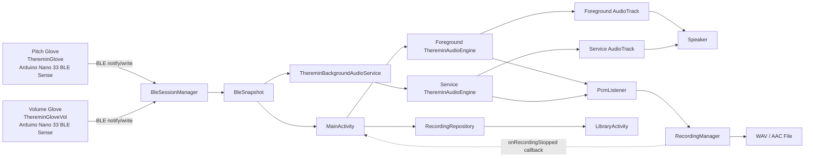
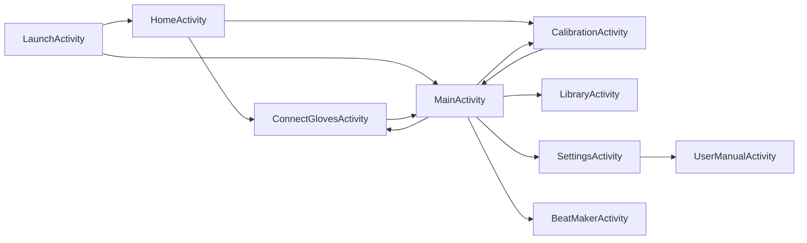

# Theremin Gloves — Design Document (Revised)

**Course:** COEN 390 / ELEC 390, Concordia University, Winter 2026  
**Team 5:** Marie Ella Cambay, Niraj Patel, Ayan Pirani, Nirthika Ilaiyarajah, Matei Moldovan

## At A Glance

| Item | Current build |
|---|---|
| Hardware | Two Arduino Nano 33 BLE Sense gloves over BLE |
| BLE host | `BleSessionManager` singleton using Nordic BLE `2.11.0` |
| Main audio path | `ThereminAudioEngine` -> `AudioTrack` |
| Background audio path | `ThereminBackgroundAudioService` with its own engine and 20 ms sync loop |
| Recording path | `PcmListener` -> `RecordingManager` -> file -> `RecordingRepository` |
| Public Play tones | 10 |
| Audio buffer | `AUDIO_WRITE_FRAMES = 1024` at `48 kHz` |
| Current orientation policy | portrait-locked activities |

This document is intentionally current-build specific. If an older Sprint note conflicts with this file, the current code and this audited draft take precedence.

## Architecture Diagram



## Activity Flow Diagram



## 1. System Overview
Theremin Gloves is an Android application that turns two BLE-connected Arduino Nano 33 BLE Sense gloves into a wireless gesture instrument. The pitch glove (`ThereminGlove`) streams wrist-angle telemetry that becomes frequency, the volume glove (`ThereminGloveVol`) streams wrist-angle telemetry that becomes amplitude, and the phone synthesizes audio locally in real time through `AudioTrack`. The product targets music students, hobbyist musicians, creators, and demo-oriented performers who want an expressive electronic instrument without physical contact, external synth hardware, or cloud services.

## 2. System Architecture

This section moves from screens to shared classes to the live data path so a reviewer can understand the system top-down.

### Activity classes and their roles
- `LaunchActivity`: launcher/loader screen. It warms heavy dependencies with `AppLaunchWarmup.begin(...)`, initializes BLE, resolves Bluetooth permissions and Bluetooth-off state, then routes first-time users to `HomeActivity` and returning users to `MainActivity`.
- `HomeActivity`: setup/onboarding screen. It prompts for BLE prerequisites, triggers `BleSessionManager.maybeStartAutoConnect()`, shows pair status, and auto-opens Play when both gloves are connected.
- `MainActivity`: the Play screen. It owns the foreground `ThereminAudioEngine`, foreground `DrumEngine`, recording UI, tone/effects/scale/octave controls, Beat Maker preview overlay, and the handoff logic between foreground playback and `ThereminBackgroundAudioService`.
- `ConnectGlovesActivity`: manual BLE control screen. It exposes connect/disconnect/reconnect actions for each glove and shows per-glove connection detail from `BleSnapshot`.
- `CalibrationActivity`: calibration screen. It edits a mutable `CalibrationDraft`, captures neutral positions, previews live audio through `ThereminBackgroundAudioService.beginCalibrationPreview(...)`, copies finalized values back into an `AppSettings` object, and then persists them through `SettingsStore`.
- `LibraryActivity`: recording browser/player. It loads metadata from `RecordingRepository`, supports search, folder organization, playback through `MediaPlayer`, rename/delete/move flows, playback modes, and custom date/duration filtering.
- `SettingsActivity`: settings screen. It toggles background audio, extended frequency range, pitch/volume direction, rename-dialog behavior, recording quality, calibration-guide visibility, and sensitivity response curve.
- `BeatMakerActivity`: dedicated 16-step sequencer editor. It uses `StepGridView`, `PianoKeyboardView`, and a local preview `AudioTrack` to edit drum/bass/piano patterns without going through the theremin audio engine.
- `UserManualActivity`: in-app user manual. Opened from Settings, it displays all 11 manual sections as scrollable cards with hardcoded content — no external file reads or network requests. The content mirrors `docs/final/03_User_Manual.md`.

### Non-Activity classes and their roles
- `BleSessionManager`: process-wide BLE host. It scans, connects, reconnects, runs the watchdog, stores cached glove MAC addresses, parses telemetry packets, exposes immutable `BleSnapshot` state, and handles Bluetooth permission/prompt flows.
- `BleSnapshot`: immutable read model describing Bluetooth state, per-glove connection state, latest telemetry, stale-data warnings, and recent event text for the UI.
- `ThereminGloveBleManager`: Nordic `BleManager` wrapper for one glove connection. It validates the custom service/characteristics, enables notifications, writes commands, and forwards callbacks to `BleSessionManager`.
- `PlayMappingState`: pure mapping state for Play. It converts live glove angles into mapped frequency/volume targets, clamps ranges, applies the sensitivity curve, and zeroes output when the instrument is not ready.
- `ThereminAudioEngine`: real-time synthesis engine. It owns the `AudioTrack`, synthesizes the theremin tone, applies vibrato/effects/scale snap, mixes optional `DrumEngine` PCM into the same mono buffer, exposes a visualizer snapshot, and provides the `PcmListener` tap used for recording.
- `ThereminBackgroundAudioService`: foreground audio service used when playback must survive outside the Play screen and during calibration preview. It owns its own `ThereminAudioEngine`, its own `DrumEngine`, and a 20 ms sync loop that mirrors `BleSnapshot` and saved settings into the service-owned engine.
- `DrumEngine`: PCM drum/bass engine. It precomputes PCM assets, schedules step timing, mixes active voices into a caller-owned mono buffer, and supports preset slots, custom Beat Maker patterns, BPM, bass, and piano synth modes.
- `SequencerClock`: self-rescheduling 16th-note clock used by the beat system to advance steps without cumulative drift.
- `RecordingManager`: `ThereminAudioEngine.PcmListener` implementation. It captures the mixed mono render buffer before stereo duplication, writes WAV directly, or encodes AAC through `MediaCodec`/`MediaMuxer`.
- `RecordingRepository`: SQLite metadata store for recordings and folders. It persists file path, name, duration, creation time, folder membership, and quality.
- `RecordingExportManager`: creates a user-visible export copy in `Music/Theremin Gloves Recordings` while the app-private original remains under internal storage.
- `SettingsStore`: single-row SQLite persistence for theremin settings plus shared-preference helpers for small UI flags.
- `AppSettings`: value object for persisted theremin/calibration/effects/sensitivity settings and their defaults.
- `CalibrationDraft`: mutable staging object for unsaved calibration edits, with sanitization and summary formatting.
- `PlayUiText`: Play-screen text formatter for titles, live frequency/volume strings, and stage-mode pills.
- `AppLaunchWarmup`: process-wide warmup cache for `SettingsStore`, `AppSettings`, `RecordingRepository`, and a warmup `DrumEngine`.
- `RecordingListAdapter`: `RecyclerView.Adapter` for library folders and recordings, including drag-into-folder and multi-select support.
- `TopNavBarView`: reusable top bar with back button, left action, glove status icons, optional overflow, and helper navigation utilities.
- `BottomNavBarView`: reusable five-tab bottom navigation bar for Play, Connect, Cal, Library, and Settings.
- `NavigationUtils`: screen navigation helpers and the reusable `Poller` class used by multiple Activities for periodic UI refresh.
- `ThereminVisualizerView`: custom waveform renderer for live Play audio.
- `ToneKnobView`: custom rotary selector for the public tone cycle.
- `KnobControlView`: custom dial control reused for calibration-style numeric adjustment.
- `StepGridView`: custom 13×16 drum/bass step-grid renderer and editor.
- `PianoKeyboardView`: on-screen piano keyboard used in Beat Maker and Play melody input.
- `PianoStepStripView`: piano-step strip helper used by the sequencer UI.
- `InsetAwareScrollView`: inset-aware scroll container that adds system-bar padding automatically.
- `Instrument` and `SynthInstrument`: lightweight PCM instrument abstractions retained for synth/sample wrappers inside the beat system.

### Data flow: Arduino glove to audio output
1. Each glove’s Arduino Nano 33 BLE Sense computes orientation from its IMU and advertises a custom BLE service.
2. The glove firmware sends ASCII packets such as `ACTIVE_DELTA_DEG:<float>`, `NEUTRAL_ROLL_DEG:<float>`, and `DIRECTION:<text>` over the TX notify characteristic.
3. `BleSessionManager` scans for devices named `ThereminGlove` and `ThereminGloveVol`, connects through `ThereminGloveBleManager`, enables notifications, and parses each packet in `handleNotification(...)`.
4. Parsed glove state is copied into a fresh immutable `BleSnapshot` returned by `BleSessionManager.getSnapshot()`.
5. In foreground Play, `MainActivity.refreshUiFast()` calls `play.syncLive(snapshot)` and `play.recompute(snapshot)`, then pushes the latest targets into `ThereminAudioEngine` with `audioEngine.setTargets(...)`.
6. In background/calibration preview, `ThereminBackgroundAudioService.pushTargets(...)` performs the same mapping every `SYNC_TICK_MS = 20` ms and pushes targets into the service-owned engine.
7. `ThereminAudioEngine` smooths target frequency/volume, synthesizes the current tone, optionally mixes `DrumEngine`, duplicates the mono buffer to stereo, and writes it to `AudioTrack`.
8. In parallel, the same mono render buffer is forwarded through the `PcmListener` tap to `RecordingManager`, which writes WAV or AAC output.
9. When recording stops, `MainActivity` receives the callback, optionally exports a user-visible copy, and saves recording metadata through `RecordingRepository`.

The practical separation is clean: BLE owns live telemetry, mapping owns control conversion, the audio engine owns synthesis, and the repository owns persisted metadata.

### Static singleton pattern in `BleSessionManager`
`BleSessionManager` is implemented as a process-wide static singleton: all mutable BLE state lives in static fields, all public entry points are static, and a static main-thread `Handler MAIN` serializes BLE operations. This design is used because BLE connectivity must survive screen changes cleanly. `HomeActivity`, `ConnectGlovesActivity`, `CalibrationActivity`, `MainActivity`, and `LaunchActivity` all need the same live connection state, recent telemetry, cached device addresses, and watchdog behavior. A process-wide singleton avoids duplicate scanners, duplicate GATT sessions, conflicting reconnect timers, and the need to rehydrate BLE state every time the user changes screens.

### How `MainActivity` and `ThereminBackgroundAudioService` handle audio ownership
The app does not currently share one literal `ThereminAudioEngine` instance between `MainActivity` and `ThereminBackgroundAudioService`. Instead:
- `MainActivity` owns a foreground `ThereminAudioEngine` while the Play screen is visible.
- `ThereminBackgroundAudioService` owns a separate service-side `ThereminAudioEngine` while background audio or calibration preview is active.
- `MainActivity` mirrors scale/effects/drum/bass/tone state into the service through static service setters such as `setActiveScale(...)`, `setReverbEnabled(...)`, `setToneTypeNow(...)`, `setRecordingManager(...)`, `startIfNeeded(...)`, and `stopIfRunning(...)`.
- This means the user experiences a playback handoff, but the implementation is a foreground-engine/service-engine ownership swap rather than two screens sharing one common object reference.

## 3. Hardware

### Arduino platform and sensors
- Each glove uses an Arduino Nano 33 BLE Sense.
- The relevant sensor path is the on-board IMU. The Android code assumes the glove firmware converts IMU data into a roll-derived control signal before transmission.
- The app does not recompute roll from raw accelerometer/gyroscope samples. It consumes the preprocessed telemetry emitted by the glove firmware.

### Two-glove setup
- Pitch glove BLE name: `ThereminGlove`
- Volume glove BLE name: `ThereminGloveVol`
- The pitch glove controls frequency.
- The volume glove controls amplitude.

### BLE service and characteristics
- Custom service UUID: `12345678-1234-1234-1234-1234567890ab`
- TX notify characteristic UUID: `12345678-1234-1234-1234-1234567890ac`
- RX write characteristic UUID: `12345678-1234-1234-1234-1234567890ad`

### Glove-to-phone packet formats parsed by Android
- `ACTIVE_DELTA_DEG:<float>`: current roll delta used for live pitch/volume mapping.
- `NEUTRAL_ROLL_DEG:<float>`: current neutral baseline captured by the glove.
- `DIRECTION:<text>`: current direction mode reported by the glove after a direction sync/toggle.

### Phone-to-glove commands sent by Android
- `H`: handshake / refresh request.
- `N`: capture the current wrist orientation as the new neutral position.
- `D`: toggle the glove’s direction mode.

## 4. BLE Communication Layer

### How `BleSessionManager` works
- Initialization: `BleSessionManager.initialize(context)` stores the application context, restores cached device addresses, registers the Bluetooth-state receiver once, and starts the watchdog loop.
- Scanning: `maybeStartAutoConnect()` and `requestConnectMissingGloves()` eventually call an internal scan path that looks for the two expected BLE names. A scan timeout stops discovery after `SCAN_TIMEOUT_MS`.
- Connecting: once a target device is found, `ThereminGloveBleManager.connectTo(...)` starts a Nordic BLE connection with `retry(3, 250)` and a configurable timeout. `onReady()` sends the handshake and enables notifications.
- Reconnecting: if a glove drops unexpectedly, `drop(...)` clears live connection state and schedules `AUTO_RECONNECT_DELAY_MS` reconnect logic. Cached MAC addresses let reconnect attempts skip a full name-based scan when possible.
- Watchdog: the main-thread watchdog runs every `WATCHDOG_PERIOD_MS`. It refreshes truth, checks connect timeouts, checks telemetry age, pings silent gloves, and forces reconnects when the connection looks alive but no telemetry is arriving.

### Exact BLE timing constants from code
- `SCAN_TIMEOUT_MS = 12_000L`
- `CONNECT_TIMEOUT_MS = 12_000L`
- `AUTO_RECONNECT_DELAY_MS = 1_500L`
- `PING_AFTER_MS = 3_000L`
- `STALE_WARNING_MS = 4_500L`
- `STALE_RECONNECT_MS = 20_000L`
- `WATCHDOG_PERIOD_MS = 1_000L`

### Silent disconnect detection
The app distinguishes a true Android GATT disconnect from a silent telemetry stall:
- Every received telemetry packet updates `glove.lastTelemetryMs`.
- If telemetry age exceeds `STALE_WARNING_MS = 4500 ms`, the glove is marked stale and the UI shows `Connected • no data`.
- If telemetry age exceeds `PING_AFTER_MS = 3000 ms` and at least 2 seconds have elapsed since the last ping, `BleSessionManager` sends another `H` handshake to prompt a reply.
- If telemetry age exceeds `STALE_RECONNECT_MS = 20_000 ms`, the app treats the session as dead, drops the glove, and schedules reconnect.
- Separate logic also aborts a connect attempt if `connectAttemptStartMs` exceeds `CONNECT_TIMEOUT_MS = 12_000 ms`.

### Android 12+ permission handling
- Android 12 and higher: `BLUETOOTH_SCAN` and `BLUETOOTH_CONNECT`
- Android 11 and lower: `ACCESS_FINE_LOCATION`
- The permission helpers are centralized in `BleSessionManager.hasRequiredPermissions(...)`, `requestRequiredPermissions(...)`, and `wereAllPermissionsGranted(...)`.
- `LaunchActivity`, `HomeActivity`, `ConnectGlovesActivity`, and `MainActivity` all call these helpers instead of duplicating version-specific permission logic.

### Nordic BLE library version and rationale
- Dependency: `no.nordicsemi.android:ble:2.11.0`
- The code uses Nordic’s `BleManager` abstraction instead of raw Android `BluetoothGatt` directly.
- Why this is beneficial here: it provides queued connection/notification/write operations, cleaner state callbacks, built-in retry/timeout helpers, and a smaller surface area for Android GATT race conditions than hand-written raw `BluetoothGatt` code.
- Inference from the code: the project relies on Nordic features such as `retry(3, 250)`, structured notification enabling, and centralized failure callbacks to keep the BLE layer readable and robust.

## 5. IMU Processing and Gesture Mapping

### How `ACTIVE_DELTA_DEG` relates to `NEUTRAL_ROLL_DEG`
The Android app treats `ACTIVE_DELTA_DEG` as already relative to the glove’s neutral position. In other words, the glove firmware captures a neutral roll angle as `NEUTRAL_ROLL_DEG`, then sends a live delta that is measured relative to that neutral reference. The Android side does not recompute that subtraction from raw IMU values; it simply parses the already-relative delta and maps it to sound.

### Frequency mapping in `PlayMappingState`
`PlayMappingState.recompute(...)` uses:

```text
pitchNorm = applySensitivityCurve(
    clamp((pitchActiveDeltaDeg - pitchAngleMinDeg) /
          (pitchAngleMaxDeg - pitchAngleMinDeg), 0, 1))

freq = freqMinHz + (freqMaxHz - freqMinHz) * pitchNorm
```

Then, if octave shift is enabled:

```text
freq = clamp(freq * 2^octaveShift, 20, 20000)
```

Additional guards:
- if the pitch glove has no angle, frequency falls back to `freqMinHz`
- if the instrument is not ready, volume is forced to zero

### Volume mapping in `PlayMappingState`
`PlayMappingState.recompute(...)` uses:

```text
volNorm = applySensitivityCurve(
    clamp((volActiveDeltaDeg - volumeAngleMinDeg) /
          (volumeAngleMaxDeg - volumeAngleMinDeg), 0, 1))

volume = 0 + (1 - 0) * volNorm
```

Then:
- if the volume glove has no angle, volume becomes `0`
- if Bluetooth is off or one glove is missing, `audioTargetVolumeLinear = 0`

### Smoothing in `ThereminAudioEngine`
- `FREQ_SMOOTHING = 0.0030f`
- `ATTACK_SMOOTHING = 0.0046f`
- `RELEASE_SMOOTHING = 0.0018f`

Implementation details:
- `smoothFreqHz += (targetFreqHz - smoothFreqHz) * FREQ_SMOOTHING`
- `smoothVolumeLinear += (target - smoothVolumeLinear) * attackOrReleaseFactor`
- Attack and release use different constants so notes fade in faster than they fade out.

### Why there is no explicit dead zone
There is no dedicated Java-side dead-zone constant in the current Play mapping path. Instead, three existing mechanisms already suppress micro-jitter:
- calibration lets the user choose a meaningful angle span
- the sensitivity response curve reshapes normalized motion
- `ThereminAudioEngine` smooths both pitch and volume continuously

That means the app currently solves the “tiny hand tremor” problem with calibration plus smoothing rather than a hard dead-band clamp.

## 6. Audio Engine

### `AudioTrack` configuration
- `SAMPLE_RATE = 48000`
- `CHANNEL_MASK = AudioFormat.CHANNEL_OUT_STEREO`
- `ENCODING = AudioFormat.ENCODING_PCM_16BIT`
- `AUDIO_WRITE_FRAMES = 1024`
- Effective stereo write size per buffer: `1024 frames × 2 channels × 2 bytes = 4096 bytes`
- `MIN_STREAM_BUFFER_BYTES = 4096`

The engine builds a low-latency `AudioTrack` with:
- usage: `USAGE_GAME`
- content type: `CONTENT_TYPE_SONIFICATION`
- low-latency performance mode on Android O+

### Current public tone set
The current Play build exposes **10 user-selectable tones**, not the older 9-waveform list that earlier documents referenced:
- `THEREMIN`: heterodyne-inspired harmonic stack with a strong second partial for the classic vocal/cello theremin color.
- `AIR_PAD`: soft detuned sine pad with slow beating and low spectral centroid.
- `CELLO`: bowed-string style preset with emphasized first partials and gentle FM motion.
- `PAD`: warm harmonic pad built from a detuned sine stack.
- `CHOIR`: soft vocal pad with shallow phase modulation and low-order harmonics.
- `FLUTE`: near-pure flute tone with only a tiny upper-harmonic shimmer.
- `CLARINET`: odd-harmonic closed-pipe spectrum that stays warm and woody.
- `TRIANGLE`: triangle-derived tone with boosted odd upper partials for extra brightness.
- `SAW`: additive saw-style spectrum using the first six harmonics.
- `HELICOPTER`: legacy rotor-like pulse tone whose theremin pitch controls chop rate.

Hidden legacy tone strings such as `SQUARE`, `PULSE`, `ORGAN`, `STRING`, `BELL`, `DRUM_KIT`, `TRUMPET`, and others are still supported internally for backward compatibility, but they are not in the public tone picker.

### Vibrato
- Rate: `VIBRATO_RATE_HZ = 4.2f`
- Minimum depth: `MIN_VIBRATO_DEPTH = 0.0003f`
- Maximum depth: `MAX_VIBRATO_DEPTH = 0.0014f`
- Depth scaling: vibrato depth grows with current smoothed volume:

```text
mix = clamp((smoothVolumeLinear - 0.03) / 0.35, 0, 1)
depth = MIN_VIBRATO_DEPTH + (MAX_VIBRATO_DEPTH - MIN_VIBRATO_DEPTH) * mix
```

So louder playing introduces slightly deeper vibrato than very quiet playing.

### PCM tap and `RecordingManager`
- `ThereminAudioEngine` defines the `PcmListener` interface.
- `RecordingManager` implements `ThereminAudioEngine.PcmListener`.
- The engine calls `listener.onPcmSamples(monoBuffer, monoBuffer.length)` before the mono buffer is duplicated into stereo for `AudioTrack`.
- Because the tap is pre-stereo and post-drum-mix, recordings capture the exact synthesized output rather than microphone audio.

### Background service and 20 ms sync loop
- `ThereminBackgroundAudioService` owns a service-side `ThereminAudioEngine` and `DrumEngine`.
- Its worker thread sleeps for `SYNC_TICK_MS = 20`.
- On each tick it reloads persisted settings as needed, reads `BleSnapshot`, applies scale/effects/drum/bass/tone/octave state, computes current frequency/volume targets, and pushes them to the service-owned audio engine.
- This same loop is also used for calibration preview.

## 7. Recording System

### `RecordingManager`
- Capture source: `ThereminAudioEngine.PcmListener`
- Input data: mixed mono PCM from the live synth path
- File output: mono input is duplicated into stereo for saved files
- Storage guard: `MIN_FREE_BYTES = 10 * 1024 * 1024`

### Quality modes
- `LOSSLESS`: WAV, PCM 16-bit, 48 kHz, stereo, no codec
- `HIGH`: AAC-LC, 320 kbps, 48 kHz, stereo (`.m4a`)
- `MEDIUM`: AAC-LC, 192 kbps, 48 kHz, stereo (`.m4a`)
- `LOW`: AAC-LC, 128 kbps, 48 kHz, stereo (`.m4a`)

### `RecordingRepository` schema and file location
- Database file: `recordings.db`
- Tables:
  - `folders(id, name, created_at_ms)`
  - `recordings(id, file_path, display_name, duration_ms, created_at_ms, folder_id, quality)`
- App-private primary recording files: `getFilesDir()/recordings/`
- Optional exported user-visible copies: `Music/Theremin Gloves Recordings` via `RecordingExportManager`
- Important nuance: `recordings.db` stores the app-private original file path. The optional exported copy is a convenience duplicate, not a separately persisted repository record.

### `LibraryActivity` features
- load all saved recordings from `RecordingRepository`
- search by display name in real time
- rename recordings
- delete recordings
- create, rename, delete, and enter folders
- drag a recording onto a folder card to move it
- multi-select move/delete
- `MediaPlayer` playback
- mini-player with progress bar
- playback modes: sequential, single, loop one, loop all
- quality badge display
- custom duration filter
- custom date-range filter

## 8. Settings and Persistence

### `SettingsStore`
- Database name: `theremin_gloves.db`
- Table name: `app_settings`
- Storage model: one row with `id = 1`

### `app_settings` columns
- `id`
- `pitch_angle_min_deg`
- `pitch_angle_max_deg`
- `freq_min_hz`
- `freq_max_hz`
- `volume_angle_min_deg`
- `volume_angle_max_deg`
- `pitch_direction_inverted`
- `volume_direction_inverted`
- `tone_type`
- `pitch_enabled`
- `volume_enabled`
- `updated_at_ms`
- `active_scale`
- `octave_shift`
- `reverb_enabled`
- `reverb_mix`
- `delay_enabled`
- `delay_feedback`
- `delay_mix`
- `distortion_enabled`
- `distortion_gain`
- `sensitivity_level`
- `sensitivity_curve`

### Migration strategy
- `SettingsStore` uses `ensureSchema(db)` plus `addColumnIfMissing(...)`
- It does not rely on destructive migrations
- A process-wide `schemaVerifiedForProcess` flag avoids repeating `PRAGMA table_info(...)` and `ALTER TABLE` checks on every screen load

### SharedPreferences flags
- Preferences file `theremin_prefs`
  - `bg_audio_enabled`
  - `extended_frequency_range_enabled`
  - `audio_compression`
  - `show_rename_dialog_on_stop`
- Preferences file `calibration_ui_prefs`
  - `calibration_guide_learned`

### `AppSettings` fields and default values
These are the persisted theremin/calibration defaults loaded into a fresh `AppSettings` object and used by `SettingsStore` plus `CalibrationDraft`. They are not the narrower Play-screen reset defaults used by `PlayMappingState.restoreDefaults()`.

| Field | Default |
|---|---|
| `pitchAngleMinDeg` | `0f` |
| `pitchAngleMaxDeg` | `90f` |
| `freqMinHz` | `20f` |
| `freqMaxHz` | `2000f` |
| `volumeAngleMinDeg` | `0f` |
| `volumeAngleMaxDeg` | `90f` |
| `pitchDirectionInverted` | `false` |
| `volumeDirectionInverted` | `true` |
| `toneType` | `THEREMIN` |
| `pitchEnabled` | `true` |
| `volumeEnabled` | `true` |
| `activeScale` | `CHROMATIC` |
| `octaveShift` | `0` |
| `reverbEnabled` | `false` |
| `reverbMix` | `0.3f` |
| `delayEnabled` | `false` |
| `delayFeedback` | `0.35f` |
| `delayMix` | `0.4f` |
| `distortionEnabled` | `false` |
| `distortionGain` | `3.0f` |
| `sensitivityLevel` | `MEDIUM` |
| `sensitivityResponseCurve` | `1.0f` |

Important nuance:
- the SQLite schema default for `tone_type` is still `'SINE'` for backward compatibility, but `SettingsStore.load()` normalizes that legacy value to `THEREMIN`

Separate Play-only defaults used by `PlayMappingState.restoreDefaults()`:
- play pitch angle range: `-15f` to `55f`
- play volume angle range: `-10f` to `55f`
- play frequency range: `880f` to `2000f`

## 9. Calibration System

### `CalibrationDraft` pattern
`CalibrationActivity` never writes directly into `AppSettings` while the user is still editing. Instead:
- persisted settings are loaded into a mutable `CalibrationDraft`
- the draft is edited through the calibration UI
- `CalibrationDraft.sanitize()` clamps angle/frequency bounds and enforces valid min/max relationships
- only when the user chooses Save does `draft.saveTo(settings)` copy the finalized values back into `AppSettings`

This avoids partial writes and makes Reload/Defaults behavior straightforward.

### `beginCalibrationPreview(...)` / `endCalibrationPreview()` flow
1. `CalibrationActivity.syncCalibrationPreview()` builds an `AppSettings` snapshot representing the current unsaved draft.
2. It calls `ThereminBackgroundAudioService.beginCalibrationPreview(context, previewSettings)`.
3. The service stores that preview object in `calibrationPreviewSettings`.
4. On each 20 ms service tick, `pushTargets(...)` uses `calibrationPreviewSettings` instead of the saved settings row.
5. When calibration is stopped, saved, or the screen leaves the foreground, `ThereminBackgroundAudioService.endCalibrationPreview()` clears the preview override.

### How neutral position is captured and stored
Neutral capture is a BLE/device-side operation:
1. The user presses `btnPitchNeutral` or `btnVolumeNeutral`.
2. `CalibrationActivity.handleNeutralCapture(...)` checks that the corresponding glove is connected.
3. `BleSessionManager.requestCaptureNeutral(isPitch)` sends the `N` command to the glove.
4. The glove replies with `NEUTRAL_ROLL_DEG:<float>`.
5. `BleSessionManager.handleNotification(...)` stores that value into the glove’s live state (`glove.neutralRollDeg`).
6. Future `ACTIVE_DELTA_DEG` packets are then interpreted relative to that neutral.

Important nuance: the neutral roll angle is not written into `SettingsStore`. The persisted calibration row stores pitch/volume/frequency ranges and tone settings; the live neutral reference itself lives in the glove/session state.

## 10. End-to-End Latency Analysis

### Fixed values from the current code
- BLE notification interval assumption: typically about `7.5–20 ms` on Android BLE links
- Background-service sync loop: `SYNC_TICK_MS = 20 ms`
- Foreground Play refresh loop: `UI_TICK_MS = 50 ms`
- Audio buffer: `AUDIO_WRITE_FRAMES / SAMPLE_RATE = 1024 / 48000 = 0.02133 s = 21.33 ms`

### Background/calibration path latency
This is the path used by `ThereminBackgroundAudioService` and calibration preview:

```text
Typical = BLE notify + average sync wait + audio buffer
        = 7.5–20 ms + ~10 ms + 21.33 ms
        = ~38.83–51.33 ms

Worst case = 20 ms + 20 ms + 21.33 ms
           = ~61.33 ms
```

### Foreground Play path latency
On the visible Play screen, `MainActivity.refreshUiFast()` runs every `UI_TICK_MS = 50 ms`, so the control-update cadence is currently looser than the service cadence:

```text
Typical = BLE notify + average UI wait + audio buffer
        = 7.5–20 ms + ~25 ms + 21.33 ms
        = ~53.83–66.33 ms

Worst case = 20 ms + 50 ms + 21.33 ms
           = ~91.33 ms
```

### Comparison against HD-11 (< 80 ms)
- Background/calibration path: comfortably under 80 ms even in the worst case.
- Foreground Play path: typical behavior is still under 80 ms, but a strict worst-case bound based on the current `UI_TICK_MS = 50 ms` exceeds 80 ms.
- This is why older documents that assumed `AUDIO_WRITE_SAMPLES = 2048` are now outdated: the current audio buffer is smaller (`1024` frames), but the real foreground limit is now the Play-screen refresh loop, not the service loop.
